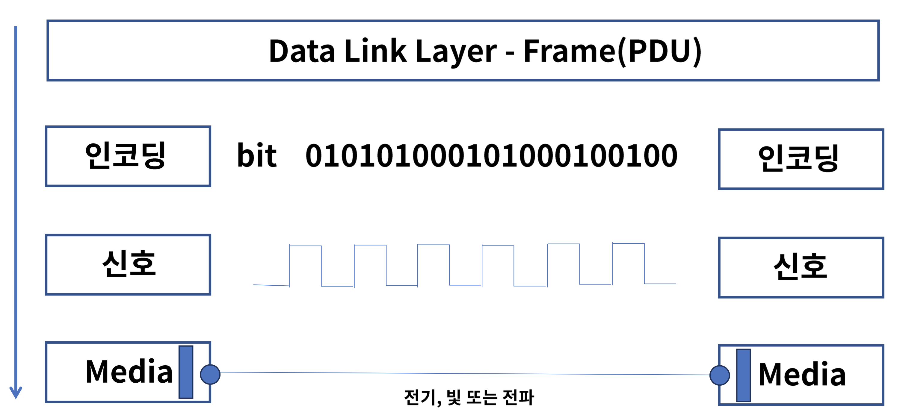
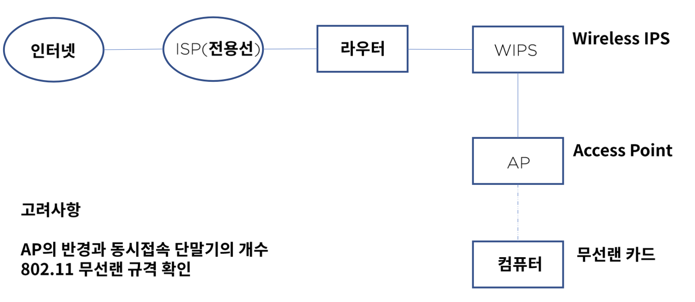

# 물리 계층

L1 물리 계층에 대해서 알아본다.

## 물리 계층의 역할과 기능

OSI 7 계층에 1계층으로 하드웨어 영역이다. 데이터 계층의 프레임을 비트로 인코 딩하고 신호로 바꾸어 통신한다. 받은 신호를 통하여 비트로 바꾸고 비트를 프레임으로 바꾸는 역활을 담당한다.

### Signalilng의 종류

- 전기 (대표적으로 UTP 케이블이 있다.)
- 광 (대표적으로 Fiber 가 있다. )
- 전파 (wifi)

### Signaling 전송 방식

## 물리 계층 장비와 케이블

물리 계층의 장비로는 대표적으로 허브와 리피터가 있다.

### 허브의 동작 방식

브로드 케스팅 방식을 사용하여 허브 내에 모든 pc 에게 송신하고 주소에 맞는 pc 만 수신 하는 형식을 사용한다.

유니 캐스트 방식은 1 : 1 통신을 의마한다.

멀티 캐스트 방식은 1 : N 통신을 의미한다.

### CSMA/CD

1. 데이터를 보내기 전에 다른 노드에서 데이터를 보내는 중인지 확인한다.
2. 보내는 곳이 없다면 전송을 시작한다.
3. 동시간대 보내게 되면 통신이 중단되고 일정 시간이 흐른 후에 다시 통신을 시작한다.

이런 방식을 Half Duplex 라고 한다. 흔히 무전기에서 사용하는 방식과 비슷하다.

Simplex : 는 단방향 통신을 의미한다.

Full Duplex : 동시 양방향 통신이 가능한 형태로 전화기와 비슷하다고 생각하면 된다.

### 성능

- Bandwidth(대역폭) - 주어진 시간대에 네트워크를 통해 이동할 수 있는 정보의 양 ( 도로 넓이 )
- Throughput(처리량) - 단위 시간당 디지털 데이터 전송으로 처리하는 양 (자동차 수 )
- Backplane(최대 처리 량) - 네트워크 장비가 최대로 처리할 수 있는 데이터 용량
- CPS : L4, 초당 커넥션 연결 수
- CC : 최대 수용 가능한 커넥션
- TPS : 초당 트랜잭션 연결 수 ,L&

## UTP 케이블과 wifi

### UTP 케이블이란?

주로 근거리 통신망 (LAN) 에 사용되는 케이블로서 자기장을 방지하기 위해 꼬여 있다.

### 코드 배열

- 8p8c
  8개의 선 배열에 따라 다이렉트 또는 크로스 케이블로 구성한다. (TIA-568A, TIA-568B)

같은 기계 끼리는 크로스로 다른 디바이스 끼리는 다이렉트로 연결한다.

- Auto MDI-x
  노드 별로 크로스냐 다이렉트냐 구분하기 어렵기 때문에 자동으로 정해지도록 할 수 있는 기술

### UTP 카테고리

UTP 케이블의 전송 가능한 대역폭을 기준으로 분류.
cat3~cat6 까지 있음

### WIFI란?

비영리 기구인 WIFI Aliance의 상표로 전자기기들이 무선랜에 연결할 수 있게 하는 기술

### 무선랜 구성

인터넷 - ISP - 라우터 - WIPS - AP - 라우터

- WIPS(Wireless IPS) : 보안과 관련된 역할을 한다.
- AP(Access Point) : 무선 허브와 같은 역할을 한다. 무선 랜카드와 연결된다.

AP 에 반경과 동시 접속 가능 단말기의 개수를 고려하여 설치해야 한다.
