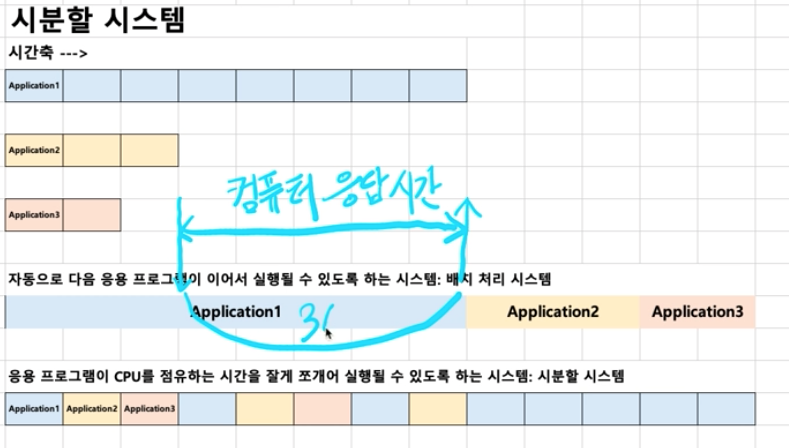

# 운영체제 History
## 1950 ~ 1960
### 1950 년대
eniac: 첫 번째 컴퓨터

당시에는 응용프로그램 1개를 돌리기도 버거웠다. 

운영체제는 없었고 운영체제가 해야할 시스템 자원 관리는 응용프로그램 자신이 했다. 

### 1960년대 초기
응용 프로그램도 늘어나고 사용자도 증가하기 시작했다. 

**배치 처리 시스템** (batch processing system) 등장

- 여러 사용자가 생기면서 프로그램이 다른 사용자의 사용이 끝날때까지 기다려야하는 문제 발생
- 다음에 실행될 파일을 순차적으로 등록할 수 있는 시스템 개발, 이를 기반으로 운영체제가 출현

### 1960년대 후반
새로운 개념이 제안됨

1. 시분할 시스템
2. 멀티태스킹

당시에는 운영체제에서 구현되지는 않았음.

>응용프로그램이 CPU를 사용하는 시간을 잘개 쪼개서 여러개의 프로그램을 동시에 실행하는 것처럼 보이게 함. 

#### 시분할 시스템
기본 목적은 다중 사용자를 지원하기 위함이였고 이를 위해서 응용프로그램이 CPU를 사용하는 시간을 잘게 쪼게서 컴퓨터 응답시간을 최소화 함.

#### 멀티 태스킹
단일 CPU에서 시간을 잘게 나눠서 프로그램을 실행함으로써 마치 병렬로 응용프로그램이 실행되도록 보이게 하는 기능

시분활 시스템과 멀티태스킹은 비스한 개념으로 많이 사용됨.

> 멀티프로그래밍? 최대한 CPU를 많이 활용하도록 하는 시스템 (시간 대비 CPU 활용도 높이기)

 

## 1970년대
UNIX의 탄생. 

제대로 된 운영체제가 처음 개발되었다. 
### NNIX 특징
현대 운영체제의 기본 기능을 모두 지원하였다. 
- 멀티 태스킹
- 시분할 시스템 
- 멀티 프로그래밍 

다중 사용자를 지원했다.

 

## 1980년대
개인용 컴퓨터가 개발되었다. 

### 들어가기전에 용어정리
- CLI : Comand Line Interface(키보드로만 조작하는 인터페이스) ex) terminal
- GUI : Graphical User Interface(그래픽 요소가 있는 인터페이스) 마우스로 조작 가능 

1980년대 후반으로 가면서 CLI 에서 GUI로 Interface가 변경되기 시작했다. 

 

## 1990년대
1. 수많은 응용프로그램이 GUI 환경에 힘입어 개발되었다. 
2. 네트 워크 기술이 발달되었다. - 월드 와이드 맵(www) 대중화
3. 오픈 소스 운동 활성화 시작 -> UNIX 계열 Os 와 오픈소스 응용 프로그램 개발
	- LINUX 운영체제 개발

 

## 2000년대 이후
1. 오픈 소스 활성화
2. 가상 머신, 대용량 병렬 처리 등 활성화

