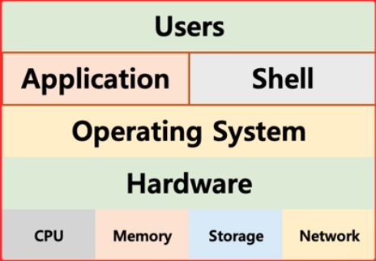
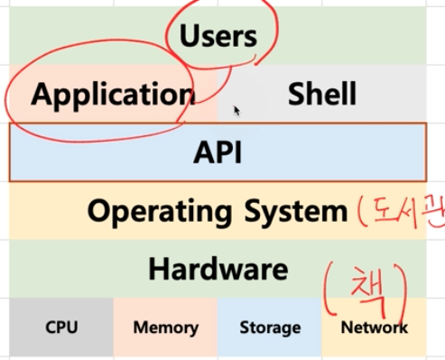
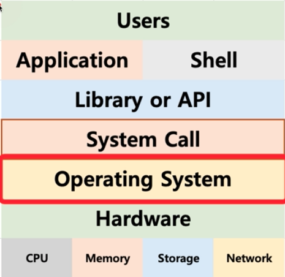
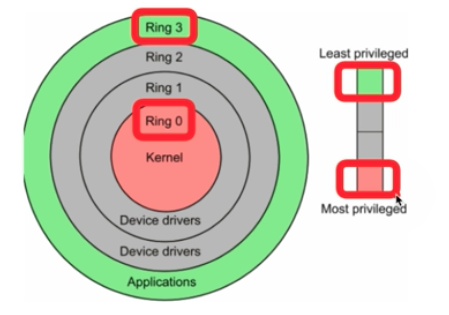
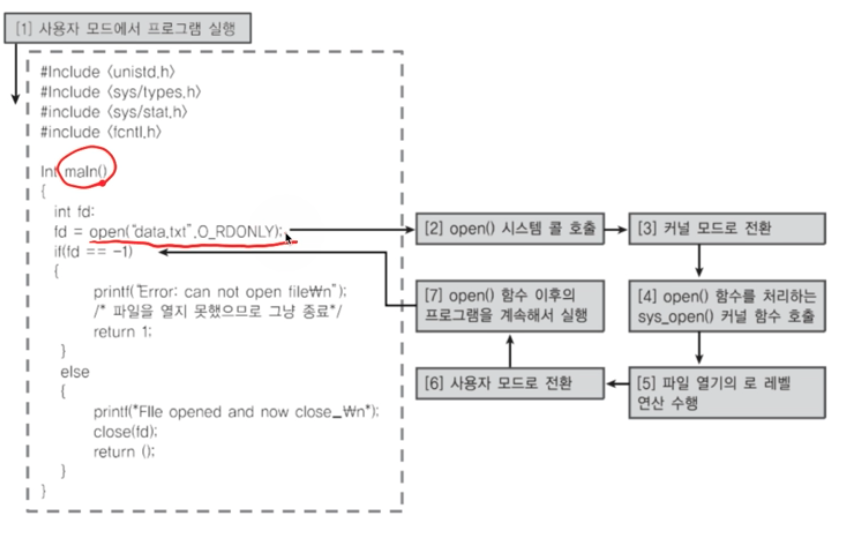

# 운영체제 구조 
## 응용 프로그램, 운영체제, 컴퓨터 하드웨어의 관계
- 운영체제는 응용 프로그램이 요청하는 메모리를 허가한다.
- 운영체제는 응용 프로그램이 요청하는 CPU 시간을 제공한다.
- 운영체제는 응용 프로그램이 요청하는 I/O 장치 사용을 허가/ 제어한다. 

 

## 운영체제는 사용자 인터페이스를 제공
쉘(shell) : 사용자가 운영체제 기능과 서비스를 조작할 수 있도록 인터페이스를 제공함.

쉘은 CLI 환경과 GUI 환경이 있음.

쉘도 응용 프로그램중에 하나라고 할 수 있다.

 

## 운영체제는 응용 프로그램을 위해서도 인터페이스 제공
AP로 제공함. (Application Programming Interface)

API는 함수 형태이거나 라이브러리 형태로 제공된다. 

쉘 또한 응용 프로그램중 하나이기 때문에 사용자의 요청이 들어오면 API 를 이욯애서 시스템 리소스에 접근한다고 할 수 있다. 

그래서 다음과 같은 구조가 된다.

### 시스템 콜
시스테 콜 인터페이스라고도 함. 

운영체제는 운영체제의 각 기능을 사용할 수 있도록 시스템 콜을 제공하는데, API는 이 시스템 콜을 호출하는 방식으로 시스템 리소스에 접근함. 

전체적은 구조는 다음과 같다.

  

### 운영체제를 만든다면
1. kernel 개발
2. 시스템 콜 개발
3. API 개발 
4. shell 개발 
5. 응용 프로그램 개발

<br/ >

## 운연체제와 시스템 콜
시스템 콜의 예
- posix API, Windows API

> API: 각 언어별 운영체제 기능 호출 인터페이스 함수   
> 시스템 콜: 운영체제 기능을 호출하는 함수

 

## CPU Protection Rings

Cpu는 권한모드가 있다. 

일반 모드는 사용자 모드 라고도 하는데 일반적인 명령에 접근할 수 있다. (Application 사용)

커널 모드는 특별한 명령어 또는 특별한 시스테 자원을 요청할 수 있는 모드이다. (Os가 사용하는)

그림에서 링으로 권한을 분리하는데 보통의 경우 ring3과 ring0을 사용해 3은 사용자 모드, 0은 커널 모드로 나눈다. 

### Kernel이 뭔데?
단어로는 씨앗 이라는 뜻이 있다.

즉 운영체제의 핵심 같은 거라고 할 수 있다. 

shell은 껍데기 라는 뜻이 있고 이 커널을 싸고 있다고 생각하면 된다. 

### 사용자 영역과 커널 영여의 분류

시스테 콜은 커널모드에서 실행된다. 

우리가 작성한 프로그램은 대부분 사용자 모드에서 실행된다. 

커널모드로 실행하려면 반드시 시스템 콜을 거처야함. 

이렇게 함으로써 특정 응용프로그램이나 사용자가 전체 컴퓨터 시스템을 헤치지 못하게 막을 수도 있다. 

 

## code ex1

해당 코드 동작시 처으에는 사용자 모드로 시작했다가 특정 API를 만났을때에는 커널 모드로 전환되고 커널 모드에서 작업 완료시 다시 사용자 모드로 전환된다.

