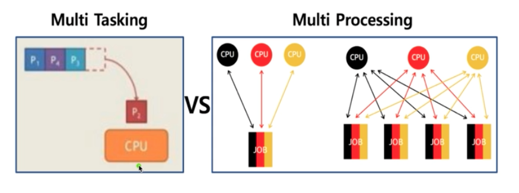
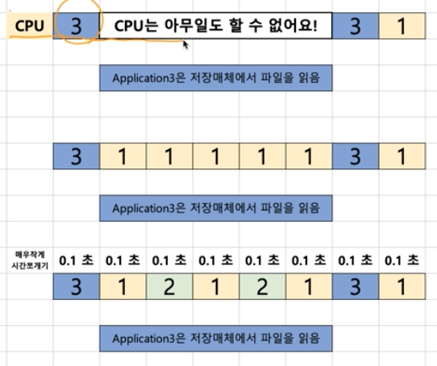
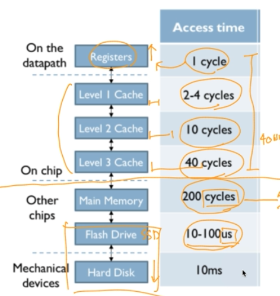

# 스케줄링
프로세스 스케쥴링에 대해서 알아본다.

여기서 말하는 프로세스는 응용 프로그램 정도로 생각한다. 

 

## 배치처리
큐와 유사한 방식으로 동작한다.

### 배치처리 시스템의 문제점?
- 시간이 적게 걸리는 프로그램이 있다고 하더라도 배치 처리 시스테으로 오래 걸리는 프로세스가 먼저 진행중이면 그만큼 기달려야 하는 문제가 있다.
- 음악을 들으면서 문서를 작업한다 든지 응용 프로그래밍 동시 사용에 대한 처리를 못했다. 
- 여러 사용자가 동시에 하나의 컴퓨터를 쓴다고 했을테 시스템 응답 시간이 커지기 때문에 다중 사용자에 대한 지원이 되지 않았다.

시분할 시스템이 등장 : 응용 프록그램이 CPU를 점유하는 시간을 굉장히 잘게 쪼개어 실행될 수 있도록 함. (다중 사용자 지원)

 

## 멀티태스킹
단일 CPU에서 응용 프로그램이 동시에 실행되는 것처럼 보이게 하는 시스템

마찬가지로 시분할 시스템을 적용하면 작동하지 프로세스가 바뀌어서 동작하는 시간이 있다고 하더라도 그 시간은 매우 작은 시간이기 때문에 사용자가 인지 하지 못한다.

실제로는 동시에 작동하지 않지만 사용자가 느끼기에 동시에 실행된다고 느끼게 되는 것이다.

 

## 멀티 프로세싱

멀티태스킹이 단일 CPU를 기준으로 동시에 보이는것을 목저으로 한다면 멀티 프로세싱은 여러 CPU 가 존재한다.

멀티 프로세싱은 여러 CPU가 하나의 응용 프로그램을 병렬로 실행시키면서 실행 속도를 극대화 하는 기술이다. 

 

## 멀티 프로그래밍
최대한 CPU를 많이 활용하도록 하는 시스템 

응용 프로그램은 온전히 CPU를 사용하기 보다 다른 작업을 수행하는 일이 많다.

어쩔 수 없이 CPU를 사용하지 못하는 상황이 오게 되는데 이때 그냥 대기하는 것이 아니라 다른 프로그래을 그 사이에 실행 시킬 수 있다면 CPU 활용률은 올라갈 것이다. 

이런 개념을 적용한것이 멀티 프로그래밍이다. 

### 메모리 계층 
CPU 밖에서 일어나는 프로세스는 속도가 느릴 수 밖에 없다. 

특히나 저장매체에서 진행되는 프로세스는 굉장히 느리다.

