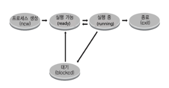
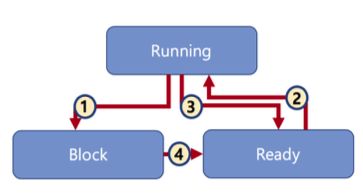
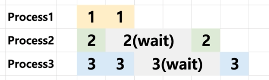
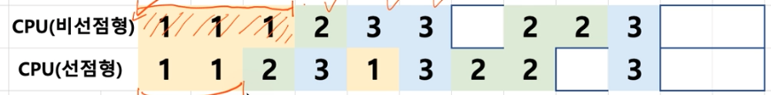

# 상태 기반 스케쥴링

## 프로세스 상태

- running state: 현재 CPU에서 실행 중인 상태
- ready state : CPU 에서 실행 가능 상태 (실행 대기 상태)
- block state: 특정 이벤트 발생 대기 상태 (파일을 다 읽었다!)

프로세스 생성과 종료는 짧은 시간 동안 발생. 

종료의 경우 실행하면서 갖고 있던 리소스를 해제하는 과정이라고 생각할 수 있다. 

 

## 프로세스 상태간 관계

1. process 가 특정 특정 cpu 사용아 아닌 다른 작업을 수행해야 하는 상태가 됨. 완료 이벤트를 기다리는 상태
2. scheduler 가 실행가능한 프로세스 중에서 하나를 골라서 실행 시킴.
3. 시분할 시스템과 같은 시스템에서 scheduler가 실행 중인 프로세스를 다른 프로세스에 실행을 위해서 ready 상태로 바꿈.
4. block 상태에 있는 프로세스가 작업을 완료 후 (완료 이벤트를 받고) ready 상태로 변화.

but, 단순한 상태만 가지고서 어떻게 스케쥴링을 하지? ready 상태가 여러개일 때에는 어떤걸 선택해야 할까?

 

## 상태별 큐를 만들자.
큐 : 앞 뒤 로 본다. 
초기 상태
- ready state queue: 1, 2, 3
- runnig state queue
- block state queue 

cpu가 아무것도 실행되고 있지 않은 상태를 idle 상태라고 한다. 

상태 별 큐를 생각하면서 어떻게 돌아갈지 생각해 보기.

**결과** [1, 2, 3, 1, 3, 2, idle, idle, 3]

 

## 선점형과 비선점형 스케쥴러
선점형 스케쥴러는 프로세스가 끝나거나 block 상태가 되지 않더라도 스케쥴러가 ready 상태로 바꾸고 다른 프로세스를 실행시키는 것이 가능한 스케쥴러이다. 

비선점형 스케쥴러는 프로세스가 block 상태가 되거나 끝나지 않으면 다른 프로세스를 실행 시키는것이 불가능한 스케쥴러이다. 

시분할 시스템을 구현하려면 선점형 스케쥴러를 구현할 수 있어야 했는데, 초기에 운영체제는 선점형 스케쥴러 구현의 어려움이 있었다. 

### 선점형과 비선점형의 차이
위에 예시에서 선점형과 비선점형을 나눠서 생각해봄. 

이번엔 시분할을 2칸으로 봄. 왜 이렇게 되는지 생각해 보자. 

비선점형은 시스템 응답시간이 길어짐. 

 

## 스케쥴러의 구분
- FIFO(FCFS), SJF, Priority-based는 어떤 프로세스를 먼저 실행시킬지에 대한 알고리즘 (비선점형에 가까움)
- RoundRobin 은 시분할 시스템을 위한 기본 알고리즘 (선점형 스케쥴러)

보통 여러가지 알고리즘을 섞어서 사용하는것이 일반적임 