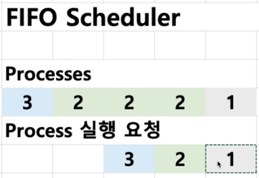
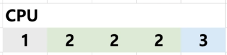
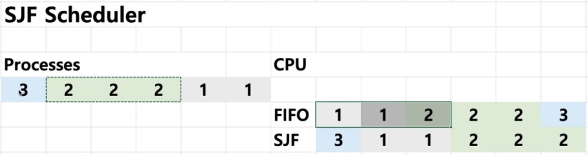
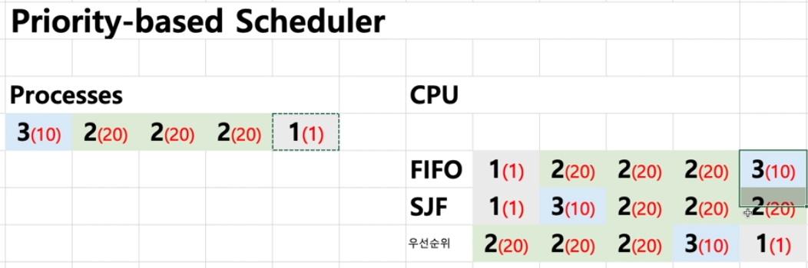
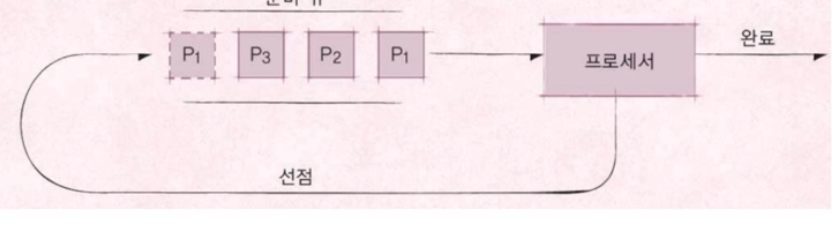
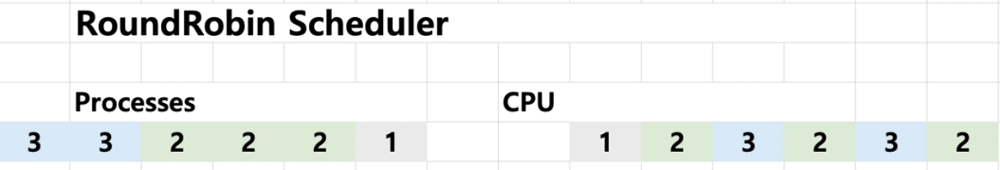

# 스케쥴링 알고리즘 기본

## 프로세스란
실행중인 프로그램을 프로세스라고 한다.

메모리에 올려져서 실행중인 프로그램이라고 보면 된다.

응용 프로그램은 =! 프로세스 

응용 프로그램은 여러개의 프로세스의 조합이기 때문이다. 

 

## 스케쥴러와 프로세스
프로세스 실행을 관리 하는 것을 스케쥴러라고 한다. 

### 스케쥴링 알고리즘
어느 순서대로 프로세스를 실행시킬까?

특정한 목표를 잡고 계획을 세우는 것

 

## FIFO 스케쥴러
프로세스가 온전히 CPU만 사용하는 작업이라고 가정한다. 

먼저 요청이 들어오면 먼저 실행 시킨다.

요청은 자료 구조중 큐와 같다.

  
1. 1번 프로세스 실행(1초)
2. 2번 실행 (3초)
3. 3번 프로세스 실행(1초)

가장 간단한 스케쥴러 (배치 처리 시스템)

FCFS 스케쥴러라고도 불림. 

 

## 최단 작업 우선(SJF) 스케쥴러
Shortest Job First : 가장 프로세스 실행시간이 짧은 것부터 실행함.

사실 일반적인 상황에서 프로세스 실행시간을 예측하는것은 불가능에 가까움. 

이상적인 스케쥴러라고 할 수 있고 특별한 상황에서 사용함. 

### 처리 순서 비교 
  

   
 

## 우선순위 기반 스케쥴러
Priority-Based : 우선순위에 기반한 스케쥴러

우선순위는 정적으로 미리 정하는 경우도 있고, 스케쥴러가 상황에 따라 동적으로 정하는 경우도 있다. 

### 처리 순서 비교

 
 

## Round Robin 스케쥴러
시분할 시스템을 적용하여 생각한다.

Round Robin Read Queue를 가져서 실행할 프로세스를 큐에 넣는다. 

큐에서 요청을 하나 빼고 실행한 프로세스가 아직 끝나지 않았다면 다시 큐에다가 해당 프로세스를 넣는다. 

모든 프로세스가 끝날때까지 반복한다. 

### 처리 순서

#### RoundRobin Ready Queue
- 3 2 1  (1번 꺼내서 실행, 1번 끝)
- 3 2 (2번 꺼내서 실행 , 2번은 아직 안끝남)
- 2 3 (3번 꺼내서 실행 , 3번은 아직 안끝남)
- 3 2 (2번 꺼내서 실행, 2번은 아직 안끝남)
- 2 3 (3번 꺼내서 실행, 3번 끝)
- 2 ( 2번 꺼내서 실행, 2번 끝)