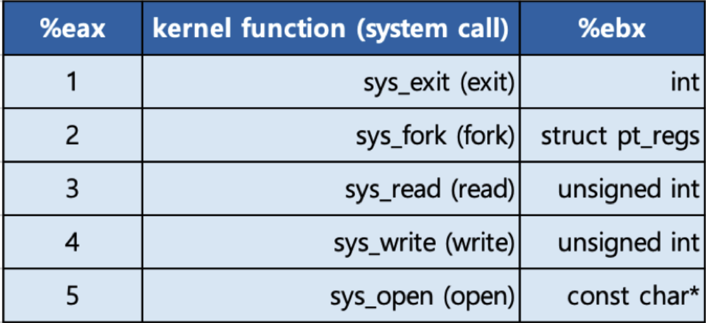

# 인터럽트

## 인터럽트란?

cpu 는 pc 에서 가르키는 code 를 실행하게 되는데 외부 I/O 나 cpu 외부에서 처리할 작업에 이벤트가 발생하게 되면 cpu 에서 이벤트 발생 여부를 알아야 할 필요가 있다.

이때 이벤트가 발생했다고 알려주는 것을 인터럽트 라고 하며 어떤 일을 하닥 인터럽트가 발생하면 cpu는 이벤트가 발생했음을 알고 해당 작업을 처리한 후 다시 원래 작업으로 돌아오는 흐름을 가질 수 있다.

### 인터럽트가 필요한 이유

선점형 스케쥴러의 구현에서 프로세스가 실행 중에서 레디 상태로 상태가 변할 수 있어야 한다.

이때 프로세스가 레디상태로 변하거나 wait가 된다는 신호를 인터럽트를 통해서 발생 시킬 수 있다.

I/O 에서 작업을 완료 한 후 wait 상태에서 다시 ready 상태가 되기 위해서는 I/O 작업이 끝났다는 신호를 알아야 한다.

이때에도 인터럽트를 통해서 I/O 처리가 끝났음을 알려준다.

입출력 하드웨어 등의 예외 상황이 발생했을 때도 CPU 에게 알려주어야 하는데 이때도 인터럽트를 사용해서 알려준다.

또한 코드 상의서 에러가 발생해서 따로 처리해 주어야 할때에도 에러가 발생했음을 알리느 인터럽트가 발생한다.

<br/>

## 인터럽트 종류

주요 인터럽트

1. 계산하는 코드에서 0으로 나누느 코드 실행시 (Divide-by-zero interrupt)

```c
#incllude <studio.h>

int main() {
	int data;
	int divider = 0;
	data = 1/divider; // 이 부분에서 인터럽트 발생
	return 0;
}
```

2. 타이머 인터럽트

하드웨어로 부터 일정한 주기마다 인터럽트를 운영체제에게 알려줌.

선점형 스케쥴러를 위해서 필요함.

3. 입출력(I/O) 인터럽트

### 내부/외부 인터럽트

- 내부 인터럽트 (소프트 인터럽트)

주로 프로그램 내부에서 명령 또는 잘못된 데이터 사용시 발생

0으로 나눴을때, 사용자 모드에서 허용되지 않은 명령 또는 공간 접근시, 계산된 결과가 Overflow/ Underflow 날때

- 외부 인터럽트 (하드웨어 인터럽트)

주로 하드웨어에서 발생되는 이벤트 (프로그램 외부)

전원이상, 기계문제, I/O, Timer 이벤트

<br/>

## 인터럽트 내부 동작

인터럽트 내부에서 어떻게 동작하는지 알아본다.

### 시스템 콜 인터럽트

시스템 콜을 실행하기 위해서는 강제로 코드에 인터럽트를 넣어서, cpu에게 실행 시켜야 한다.

```
mov eax, 1
mov ebx, 0
int 0x80
```

- eax 레지스터에 시스템 콜 번호를 넣음.
- ebx 레지스테에 시스템 콜에 해당하는 인자값을 넣음.
- 소프트웨어 인터럽트를 호출하면서 0x80 을 넘겨줌. (int 는 opcode)

예에서 0x80이라는 인터럽트는 시스템 콜을 호출하는 인터럽트 번호라는 의미임.

1. int opcode 를 통해서 인터럽트 발생한것을 알게 됨.
2. CPU는 사용자 모드에서 커널 모드로 바꿈
3. IDT(interrupt Descriptor Table) 에서 0x80 에 해당하는 함수를 실행함. 0x80은 system_call()
4. system_call() 함수에서 eax 로부터 시스템 콜 번호를 찾아서, 해당 번호에 해당하는 함수로 시스템 콜 이동.
5. 해당 함수 실행 후 커널모드에서 다시 사용자 모드로 변경. 다시 해당 프로세스에 다음 실행.

 

<br/>

### 인터럽트와 IDT
인터럽트는 IDT(Interrupt Descriptor Table)이라 불리는 곳에 각각 번호와 실행 코드를 가리키는 주소가 기록되어 있음. 

운영체제가 컴퓨터 부팅시 기록한다. 


