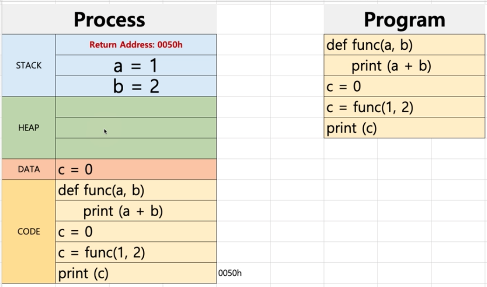
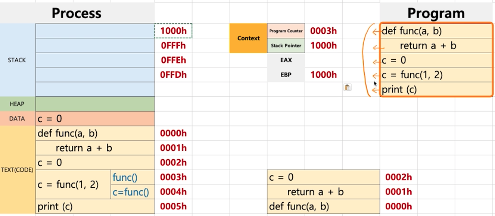
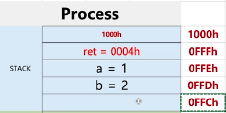
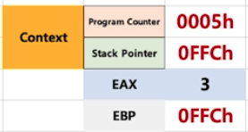

# 프로세스와 컨텍스트 스위칭
컨텍스트 스위칭이란 스케쥴러가 어떤 프로세스 A를 실행할때 B로 바꿔주는 메커니즘이다. 컨텍스트 스위칭을 이해하기 위해서는 프로세스 구조에 대해서 이해하는 것이 필요하다.

 

## 프로세스 구조 

- `code` 라는 영역에 컴파일된 소스코드가 위치한다. 
- `data` 라는 영역에 변수가 설정된다. (전역 변수)
- `stack` 이라는 영역에 함수에 대한 코드가 설정된다. 
  - `return address` 함수가 실행 된 후에 가야 할 주소 이다. 
  - 스택 이라는 자료구조처럼 할당한다음 마지막 할당한 것부터 처리해서 처음 할당한 `return address` 까지 처리하게 된다. 
- `heap`에 동적으로 할당한 변수들이 위치하게 된다. 

 

## 컴퓨터 구조
PC(Program Counter) + SP(Stack Pointer) 가 어떻게 작동하는지

- Program Counter는 초기값이 0000h 이고 1씩 늘어나면서 증가할 것이다. 
- EBP 에는 Stack Pointer 가 가리키는 최상단 주소가 적혀 있고, Stack return adress 보다 이 주소가 먼저 적힌다.
  - EBP 가 있음으로 인해서 함수에 문제가 생겼을때 어디서 문제가 생겼는지 확인할 수 있다. EBP 에는 함수가 호출된 최상단을 항상 가르키고 있기 때문에 문제가 생긴 호출이 어디서 발생했는지 알 수 있는 것이다. 

0003h 에서 함수를 실행시켰을때 stack Pointr는 1000h를 가르키고 있었고 EBP 또한 1000h 일 것이다. 따라서 stack 영역에는 다음과 같이 할당 되게 된다. stack이 점점 쌓임에 따라서 stack Pointer 도 1씩 감소하게 될 것이다. 그리고 그림과 같은 상황에서 stack pointer 는 0FFCh 가 될 것이고, EBP 또한 0FFCh가 된다. 

만약 함수 안에서 또다른 함수가 호출되었다면? 처음 알고리즘과 똑같이 EBP에 값인 0FFCh 가 적힌다. 이 주소를 통해서 만약 문제가 생겼다면 어디서 문제가 생긴건지 알 수 있게 되는 것이다. 

- 반환 값은 EAX에 들어간다. 
- c라는 변수의 값은 EAX를 참조해서 가져간다. 

 

 

## 힙
