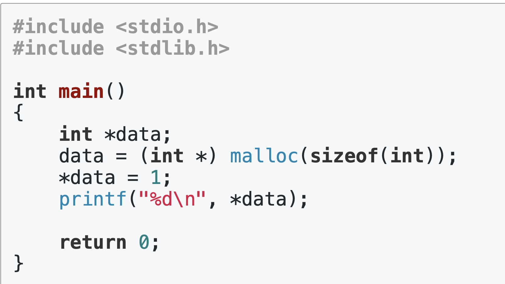
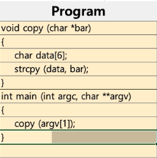
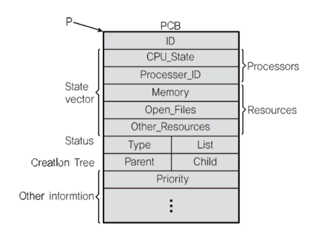

# 프로세스와 컨텍스트 스위칭
컨텍스트 스위칭이란 스케쥴러가 어떤 프로세스 A를 실행할때 B로 바꿔주는 메커니즘이다. 컨텍스트 스위칭을 이해하기 위해서는 프로세스 구조에 대해서 이해하는 것이 필요하다.

 

## 프로세스 구조 

- `code` 라는 영역에 컴파일된 소스코드가 위치한다. 
- `data` 라는 영역에 변수가 설정된다. (전역 변수)
- `stack` 이라는 영역에 함수에 대한 코드가 설정된다. 
  - `return address` 함수가 실행 된 후에 가야 할 주소 이다. 
  - 스택 이라는 자료구조처럼 할당한다음 마지막 할당한 것부터 처리해서 처음 할당한 `return address` 까지 처리하게 된다. 
- `heap`에 동적으로 할당한 변수들이 위치하게 된다. 

 

## 컴퓨터 구조
PC(Program Counter) + SP(Stack Pointer) 가 어떻게 작동하는지

- Program Counter는 초기값이 0000h 이고 1씩 늘어나면서 증가할 것이다. 
- EBP 에는 Stack Pointer 가 가리키는 최상단 주소가 적혀 있고, Stack return adress 보다 이 주소가 먼저 적힌다.
  - EBP 가 있음으로 인해서 함수에 문제가 생겼을때 어디서 문제가 생겼는지 확인할 수 있다. EBP 에는 함수가 호출된 최상단을 항상 가르키고 있기 때문에 문제가 생긴 호출이 어디서 발생했는지 알 수 있는 것이다. 

0003h 에서 함수를 실행시켰을때 stack Pointr는 1000h를 가르키고 있었고 EBP 또한 1000h 일 것이다. 따라서 stack 영역에는 다음과 같이 할당 되게 된다. stack이 점점 쌓임에 따라서 stack Pointer 도 1씩 감소하게 될 것이다. 그리고 그림과 같은 상황에서 stack pointer 는 0FFCh 가 될 것이고, EBP 또한 0FFCh가 된다. 

만약 함수 안에서 또다른 함수가 호출되었다면? 처음 알고리즘과 똑같이 EBP에 값인 0FFCh 가 적힌다. 이 주소를 통해서 만약 문제가 생겼다면 어디서 문제가 생긴건지 알 수 있게 되는 것이다. 

- 반환 값은 EAX에 들어간다. 
- c라는 변수의 값은 EAX를 참조해서 가져간다. 

 

 

## 힙

malloc 을 통해서 동적으로 생성한 변수 data는 heap 에 위치하게 된다. 지역변수인 *data (data의 주소 int *data) 는 stack 에 위치하게 된다. 힙에다가 공간을 마련한다고 생각하면 된다. 

 

## DATA 분리
전역 변수의 공간인 DATA는 초기화 되지 않는 전역 변수를 위한 공간인 BSS와, 초기값이 있는 전역 변수를 위한 공간인 DATA로 나뉜다.

 

## stack 오버플로우?

data 배열의 사이즈로 6으로 정의했기 때문에 스택에 data를 할당함. 그런데 bar의 크기가 6을 넘어가는 크기라면 원래 스택에 data로 정의되어야 할 크기를 넘어서 return adress 가 적혀햘 부분에 덮어씌우기가 될 수 있음. 이것을 악의적으로 이용해서 프로세스를 원하는 주소로 이동시키는 방법을 해커들이 많이 사용했음. 

 

## 컨텍스트 스위칭
PC와 SP에 집중해 보자. 컨텍스트 스위칭은 스케쥴러가 실행중인 프로세스를 변경시키는 것이다. 생각해보면 변경하는 프로세스가 어디만큼 진행했는지에 대한 정보를 저장해야지 다음 프로세서로 변경시킬수 있지 않을까? 
### PCB (Process Control Block)
프로세슬 변경하기전에 PCB라고 하는 곳에 PC와 SP 정보를 저장한다. 
그다음 다른 프로세스로 가서 PCB에 정보를 확인하고 PC와 SP 정보를 CPU에 덮어 씌운다. 
그리고 프로세스를 실행시킨다. 

PCB에는 몇가지 정보가 적혀있음. 

1. Process ID
2. Register값 (PC, SP)
3. Schduling Info (Process State)
4. Memory Info(메모리 사이즈 limit)
5. ...

#### 리눅스 PCB 

### 개념 정리

> 디스패치 : ready 상태의 프로세스를 running 상태로 바꾸는 것

컨텍스트 스위칭은 굉장히 짧은 시간에 진행되어야 하기 때문에 어셈블리어로 구현된다. 
