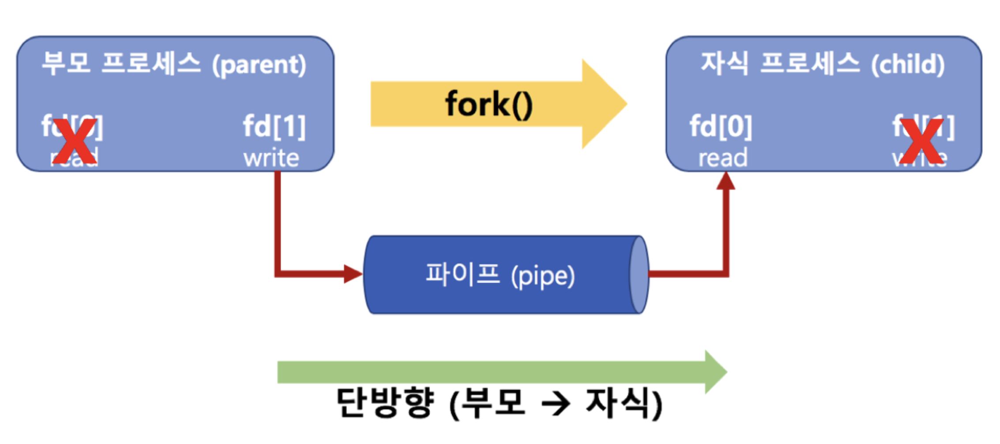

# IPC 
프로세스가 커널 공간을 공유한다. 

 

## 파이프
부모 에서 자식으로 단방향 통신이 가능하다.
fork()를 통해서 자식 프로세스를 만들었을때 PID 는 자식 프로세스가 0 부모 프로세스가 0이 아닌 값이다. 
이를 이용해서 서로 다른 로직을 작성한다. 

fd라는 배열을 이욯새통신한다. 부모 프로세스에서 fd[1] 를에 write를 진행하면 자식 프로세스에서 fd[0]을 통해서 읽을 수 있다. 이때 파이프를 통해서 통신이 이루어지는데 이 파이프가 커널 영역에 존재해서 통신이 가능하게 된다.

 
 

## 메세지 큐
키 값을 통해 메세지 큐에 접근한다. 다른 프로세스에서 메세지 큐로 전송하면 또 다른 프로세스에서 메세지 큐에 내용을 읽는 방법으로 통신이 일어난다. 

큐에 이기 때문에 FIFO 정책을 따른다. 
메시지 큐 또한 커널 영역에 있다. 

### 메시지 큐와 파이프에 차이점
메시지 큐는 fork 할필요가 없다. 
또한, 메세지 큐를 두개 사용하면 양방향 통신도 가능하다.

 

## 공유 메모리 
메모리에 커널영역에 공유 할수있는 메모리 여역을 할당하고 참조해서 통신하는 방식.
마치 변수처럼 공유된 메모리를 사용할 수 있다. 

 

## 시그널
프로세스가 프로세스에게 어떤 이벤트가 발생했음을 알려줌.
여러가지 시그널이 존재한다. 

기본동작이 없는 시그널에 동작을 정의하고 시그널을 발생 시키는 방식으로 프로세스간 통신을 한다. 
커널모드에서 사용자모드로 전환시 시그널을 처리한다. 

 

## 소켓
네트워크 통신을 위한 기술이다.
소켓을 이용해서 다른 컴퓨터와 통신하는 것이 아니라 컴퓨터 내에서 다른 프로세스간에 통시에 이용하면 프로세스간 통신을 할 수 있다. 

소캣을 사용하면 네트워크 디바이스 드라이버 까지 가서 통신을 하게 되는데, 이부분이 커널 영역에 있기 때문에 가능하다.

