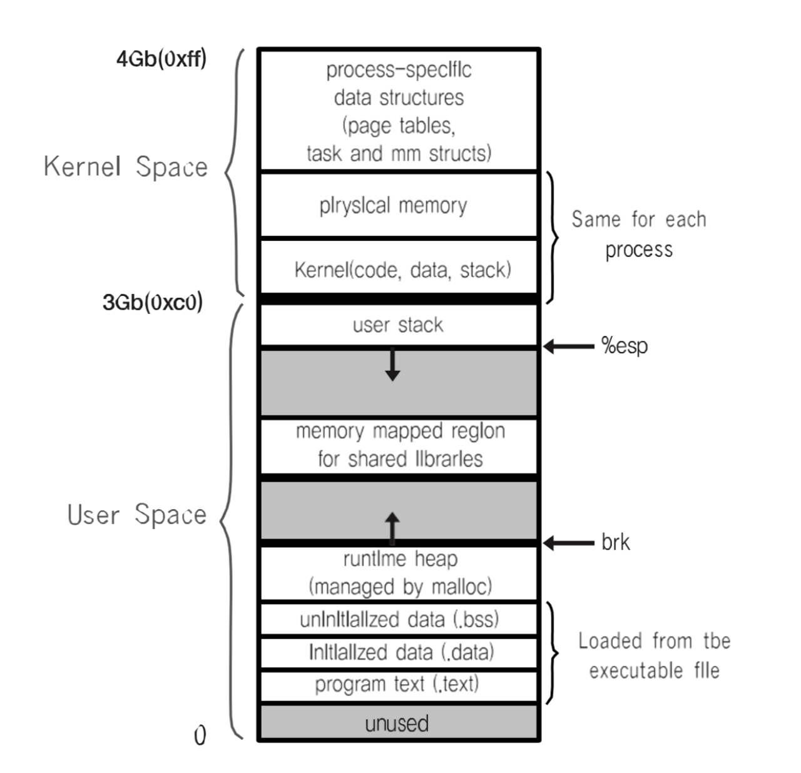

# 프로세스간 커뮤니케이션
InterProcess Communication 으로서 (IPC)라는 용어를 많이 사용한다. 

 

## 프로세스간 커뮤니케이션이 필요할까?
원칙적으로는 프로세스간 커뮤니케이션은 위험하다. 
프로세스가 다른 프로세스를 제어 하게 되면 해킹이랑 같다. 

따라서 기본적으로 모든 프로세스는 독립되어 있고 서로 가상 메모리를 사용하기 때문에 프로세스 내에서 다른 프로세스에 메모리 주소와 같은 주소로 접근한다고 해도 프로세스를 넘어서는 참조가 불가능하다. 
왜냐하면 그 주소는 가상 메모리 이고 실제 메모리에는 무엇이 있을지 모르기 때문이다. 
프로세스 내에서 접근하는 메모리 주소는 가상 메모리 주소임을 기억하자.

### 그럼에도 불구하고 필요하다.
요즘에 CPU는 다중 코어를 지원하기 때문에 성능을 잘 활용하기 위해서는 프로세스간의 통신이 필요하다. 

 

## 공유하는 파일을 통한 방법
어떤 프로세스든 저장매체는 사용할 것이다. 
프로세스 끼리에 접근은 불가능하지만 저장매체를 통한 통신은 가능하기 때문에 파일을 통해서 결과값을 공유한다던지에 기능을 사용할 수 있다. 

### 문제점? 
공유하는 파일에 동기화가 어렵다. 프로세스1에서 공유하는 파일을 최신화 했더라도 프로세스 2에서는 확인할 방법이 없다. 확인하려면 확인하는 작업을 위한 코드를 또 작성해야 하고 언제 최신화 할지 모르는 작업을 위해 이런것을 반복해야 한다.

또한, 기본적으로 저장매체를 갔다 오는데 메모리에 비해서 시간이 오래 걸린다. 

 

## 프로세스 구조 실제 예 리눅스

모든 프로세스는 4기가에 공간을 갖는다.
실제로 4기가는 아니고 가상 메모리로 4기가를 갖는다. 
사용자 영역인 0\~3 기가에 코드에서 커널 영역인 3\~4기가 영역을 접근하는 것은 불가능하다. 

 

## 커널 영역은 공유 가능하다.
프로세스가 10 존재한다면 운영체제 부분이 있는 커널 영역도 10개가 존재한다는 말인데 그러면 비효율 적이지 않나?

간단히 말하면 프로세스에 커널 영역은 실제 메모리 영역 부분을 참조한다. 그래서 같은 영역을 바라보기 때문에 공유 하고 있다. 이렇게 보면 10개 다 만들어지는 것이 아니라 운영체제 부분인 커널 영역은 물리 메모리에 존재하고 10개의 프로세스가 그 물리 메모리에 주소를 참조한다고 볼 수 있다. 

 

## 핵심은 커널이다.
다양한 IPC 기법이 존재한다. 
앞에서 보았듯이 모든 프로세스는 커널 영역을 공유하고 있다.
따라서 다양한 IPC 기법에 들어가는 핵심은 커널 영역을 사용하는 것이다. 

