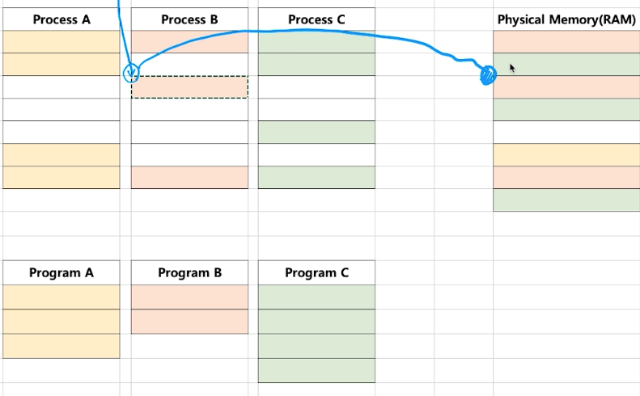
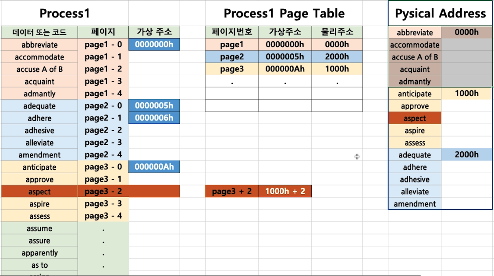
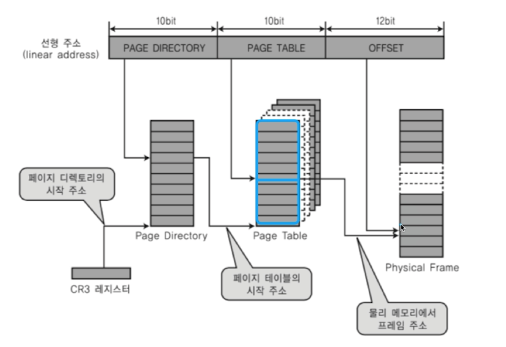
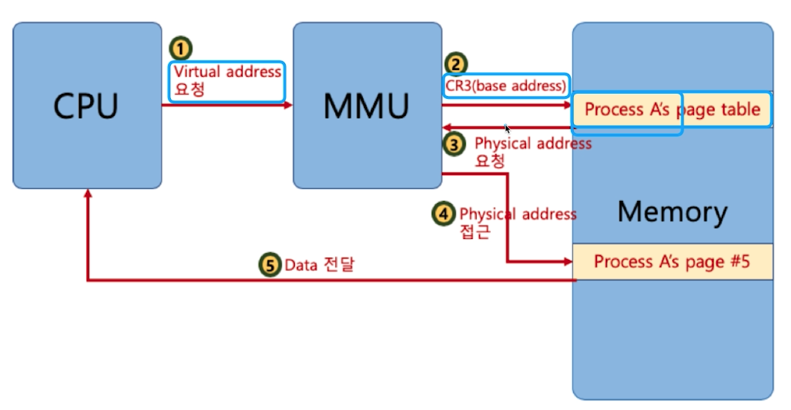
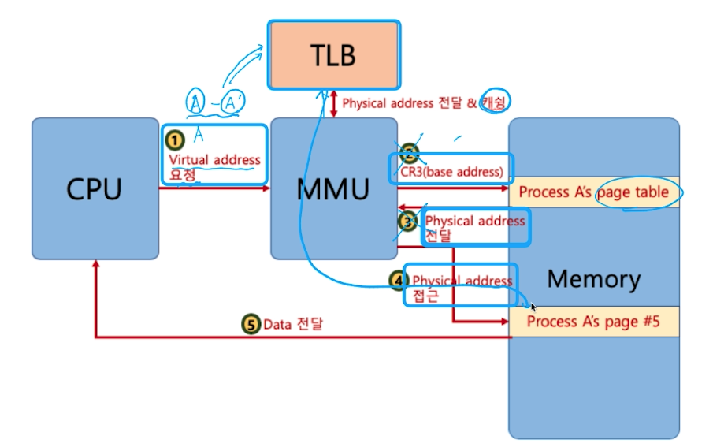
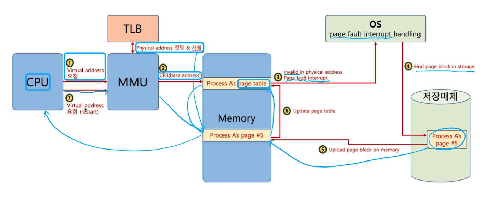

# 가상메모리
하나의 프로세스는 4기가의 크기를 가짐.
모든 컴퓨터는 폰노이만 구조를 따르기 때문에 코드는 메모리에 반드시 올라가야 한다. 
그러나 보통의 컴퓨터는 8\~16 기가에 크기를 가지는데 어떻게 여러 프로세스를 구동 시키는 걸까?

프로세스마다 특정 시점에서 cpu가 실행시킬수 있는 부분은 극히 작은 영역 이다. 
따라서 작은 영역만 물리 메모리에 올려 놓고 주소를 참조할 수 있게 하는 방법을 사용한다. 

## 기본 아이디어 
프로세스는 가상 주소를 참조하여 실행시키고 실제 데이터를 읽고 쓸때만 물리 주소로 변경하여 준다. 
가상 주소를 물리 주소로 바꿔주는 과정이 필요하다. 

### MMU (Memory Management Unit)
CPU에서 가상 메모리 주소 접근이 필요할때, 가상 메모리 주소를 물리 주소값으로 변환 시켜주는 하드웨어 장치

 

## 페이징 시스템 (Paging system)
크기가 동일한 페이지로 가상 주소공관과 이에 매칭하는 물리 주소 공관을 관리 하는 것이다. 
하드웨어 지원이 필요하고 각가의 운영체제마다 관리하는 페이지의 크기는 다 다르다.

리눅수에서는 4kb로 페이지를 관리하는데 프로세스 크기가 4gb이기 때문에 4gb를 4kb로 나눠서 각각의 페이지에 번호를 붙혀서 관리한다. 

프로세스의 PCB 안에 Page Table 이라는 구조체가 있다. 
여기에 각각의 페이지에 대한 실제 물리 주소 매핑 정보가 들어 있는데, CPU 에서 이를 참고하여 페이지를 관리한다. 

### 페이지 시스템의 구조
9kb 에 프로세스가 있다고 하고 페이지에 크기가 4kb 라고 하면 나머지인 1kb만 실제 물리 메모리 매핑으로 넣는 것이 아니라 1kb코드 영역 나머지 3kb 는 빈 영역으로 해서 매핑시킨다. 

가상 주소 V = (p, d)
- p: 가상 메모리 페이지
- d: p안에서 참조하는 위치 (변위)

페이지는 무조건 공통된 크기만큼을 넣어주어야 하기 때문에 페이지 내에서 실제 코드가 있는 부분과 페이지 주소가 같지 않을 수 있다.
따라서, 특정 역역만큼 변위를 저장할 수 있도록 해서 정확하게 코드에 매칭될 수 있도록 한다. 

실제로는 Page Tbale 안에 물리 주소로 들어가 있는지 여부를 확인하는 valid-invalid bit 가 존재한다. 

 

## 다중 단계 페이징 시스템
프로세스를 구성하는 코드 부분이 실제로 4기가를 다 채우는 일은 적다. 
따라서 모든 페이지를 페이지 테이블로 만들어서 메모리에 올리는 일은 굉장히 비효율적인 일이 될것이다. 

페이지 정보를 단계를 나누어 생성하면 이런 문제를 해결 할 수 있다. 
이를 다중 단계 페이징 시스템이라고 한다. 

CR3 레지스터에서 페이지 디렉터리를 읽어옴. 
페이지 데릭터리를 통해서 페이지 테이블을 읽어옴. (페이지 디렉터리를 활용해서 필요한 부분의 페이지 테이블만 만듦.)

 

## MMU와 TLB(컴퓨터 구조)

이런 식으로 물리 메모리를 구하게 되는데 문제는 메모리로 이동하는 시간이 오래 걸린다는 것이다. 

TLB(Translation Lookaside Buffer): 페이지 정보 캐쉬

TLB를 통해서 최근에 흭득한 매핑 정보를 캐쉬 해서 메모리에 접근을 안하도록 한다. 

 
 

## 페이징 시스템과 공유 메모리
어떤 프로세스를 포크 했다면 포크한 포르세스에서 페이지 테이블을 이용해 특정 공간을 복사한 프로세스에 특정 공간이 실제 물리 메모리에서 바라보는 공간으로 매칭 시킨다면 공유 메모리가 되어 공간을 절약하고, 메모리 할당 시간을 절약할 수 있다. 

다만, 포크한 프로세스에서 공유하고 있는 공간에서 쓰기 작업을 해야할때에는 복사한 프로세스에 영향을 주면 안되기 때문에 이때에는 실제 메모리에서 복사가 일어나고 포크한 페이지 테이블에서 복사한 공간을 바라보도록 수정한다. 

 

## 요구 페이징(Demand Paging or Demanded Paging)
선행 페이징의 반대 개념. (미리 메모리에 올려 놓는 개념)

미리 메모리에 올려 놓는 것이 아니라 특정 시점에서 필요한 부분만 메모리에 올려놓는 것을 요구 페이징이라고 한다. 페이지 테이블에서 valid-invalid bit를 확인하여 메모리에 올라가 있지 않다면 올리거나 따로 필요하지 않게 되면 내리는 시스템이다. 
메모리에 올려 놓는 페이지를 교체해야 하기 때문에 교체 알고리즘이 필요하다. 

### 페이지 폴트
어떤 페이지가 메모리에 없을때 발생되는 인터럽트, 인터럽트가 발생되면 해당 페이지를 메모리에 올려 놓게 된다. 

전체적인 구조 & 순서

페이지 폴트가 자주 일어나면 이런 작업을 많이 해야 하기 때문에 시간이 올래 걸린다. 
페이지 폴트가 안 일어나게 하는게 제일 좋은데 그렇게 하려면 앞으로 메모리에 올릴 페이지가 무엇인지 예측하는 방법을 사용해야 한다. 
이 작업에 여러 알고리즘이 있지만 여전히 어려운 부분이다. 
