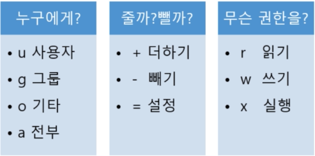

# shell
쉘 - 사용자와 컴퓨터 하드웨어 또는 운영체제 간의 인터페이스 

## 쉘 종류 
- bash
- sh
- csh
- ksh 

## 다중 사용자 관련 명령어
`whoami` - 사용자 이름 출력

`passwd` - 새로운 패스워드 설정
(aws 에서 만들었으면 이미 설정된 아이디 사용하므로 패스워드가 없음)
root 권한만 사용할 수 있음. 

`useradd`는 사용자 기본 설정 자동으로 하지 않음.

`adduser`는 사용자 기본 설정을 자동으로 함. (이거 사용해) - root 사용자가 만들 수 있음 

`sudo` root 권한으로 실행하기 
(해당 id 가 sudo 를 사용할수 있도록 미리 설정되어야 함.)

`su` 사용자 변경 

	- `su root`  현재 사용자의 설정 파일을 기반으로 id만 바
	- `su - root` 변경되는 사용자의 환경설정을 기반으로 id도 바뀜 

### sudo 
`/etc/sudoers` 설정 파일에서 설정을 해주어야 함. 
root 권한이어야 읽을 수 있고 수정할 수 있음. 
새로 생성한 id에 sudo 사용 권한을 주고 싶다면 
`dave2		ALL=(ALL:ALL) ALL`

> 1. 특정 사용자가 sudo를 사용할 수 있도록 `userid		ALL=(ALL)		ALL`
> 2. 특정 그룹에 포함된 모든 사용자가 sudo를 사용할 수 있도록 `%group		ALL=(ALL)		ALL`
> 3. 패스워드 생략 설정 `%group		ALL=(ALL)		NOPASSWD: ALL`

`pwd` 현재 디렉토리 위치

`cd` 디렉토리 이동 `cd - ` 바로 전 디렉토리로 이동 

`dir` 파일 목록 `ls` 랑 똑타음 플래그 사용하려면 `ls` 사용하는게 나음.

와일드 카드 
- `*` 는 임의 문자열
- `?` 는 문자 하나 

`man` man 띄고 명령어 입력하면 플래그 정보를 알 수 있음. 

### ls와 파일 권한
리눅스는 파일마다 소유자, 소유자 그룹, 모든 사용대한 읽고, 쓰고, 실행하는 권한을 설정한다.

`- rwx rx- r-x`
- 처음 1칸 데이터가 파일이면 -, 폴더면 d
- 다음 3칸 소유자의 권한 
- 다음 3칸 그룹의 권한 
- 다음 3칸 기타 상자의 권한 

r : 읽고, 카피 (ls 명령어 가능)

w : 수정 (파일 생성 가능)

x : 실행 (cd 접근 가능)

`chmod` : 파일 권한 변경



```
chmod g+rx test.c
chmod u+rx test.c
chmod ug+rx test.c
chmod u=rwx, g=rw, o=rx test.c
```

숫자를 사용하는 방법
```
rwx rwx rwx = 777
r-x r-x r-x = 555
r-- --- --- = 400
rwx --- --- = 700
```

`chown` 소유자 변경

`cat` 파일 내용 보기 

`head` 앞부분 보기

`tail` 끝 부분만 보기 

`more` 화면에 보일 수 있는 부분만 보고 나머지는 스크롤 하면서 보겠다. 

`rm` remove 에 약자 
- r: 하위 디렉토리를 포함한 모든 파일 삭제 
- f: 강제로 파일이나 디릭토리 삭제 

`rm -rf [dir]`
