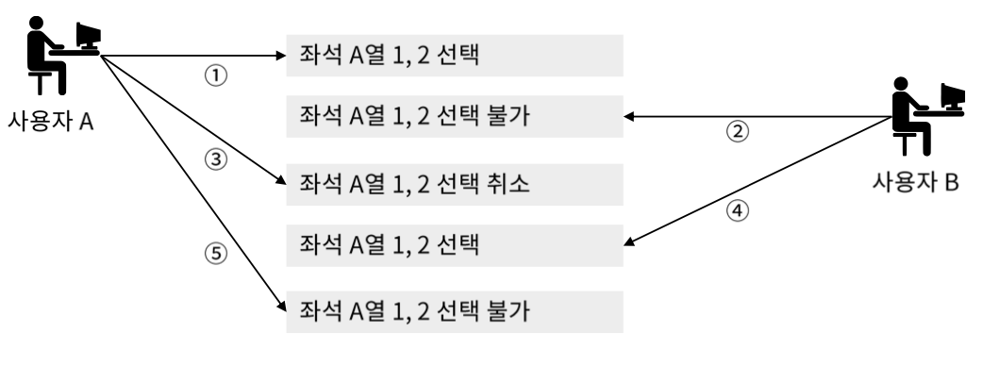
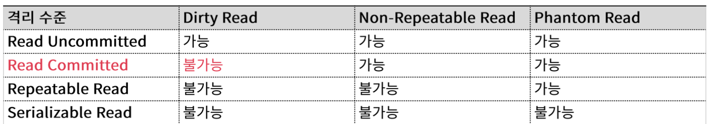

# 트랜잭션

## 트랜잭션이란?

트랜잭션은 데이터베이스 시스템에서 상호작용 단위로서 어떤 기능에 한 단위라고 생가하면 된다. 예를 들어서 송금 서비스의 입근 요청부터 확인까지의 단위이나, 예매 시스템에서 좌석을 확인하고 예매까지 하는 한 뒨위라고 할 수 있다.

### 트랜잭션의 4대 특징(ACID)

1. 원자성(Atomicty) : 데이터 조작이 전부 성공 혹은 전부 실패할지 보증하는 구조
2. 일관성(Consistency) : 데이터 조작 전후에 일관성 유지, 기존의 데이터베이스가 `Correct State` 라면 트렌잭션을 수행하고 난 후에도 `Correct State` 여야 한다. -> 도메인 유효봄위, 무결성 제약조건 등의 제약조건을 위배하지 않는 정상적인 상태, 예를들어 시스템에 사용자 등록 시 등록본호에 유일성 제약을 설정하는것과, 잔액이 있어야 송금 할 수 잇다는 일관성을 지키는 것등이 있다.
3. 고립성(Isolation) : 복수 사용자가 동시에 데이터 조작을 실행한 경우 각각의 처리가 모순 없이 실행되는 것을 보증, 트랜잭션 격리 수준
4. 지속성(Durability) : 데이터 조작 완료 후 완료 통지 받는 시점에서 결과를 잃지 않는것, 즉 트랜잭션이 Commit 되고 나면 데이터 변경 사항이 영구적으로 확장되도록 보장하는 것

## 트랜잭션 처리의 필요성

### 원자성의 중요성

트랜잭션은 전부 성공하거나 혹은 전부 실패 해야 한다. 부분 성공이 있으면 안된다. 예를 들어서 어떤 얘매 시스템에서 좌석을 선택하고 결제단계에서 취소했다면 부분적 성공인 좌석 선택까지를 그대로 성공으로 두는 것이 아니라 모두 실패로 좌석 선택까지 실패시키는 것이다. 이렇게 해야 다른 사람이 좌석을 선택할 수 잇다.

### 고립성의 중요성

복수의 사용자가 트랜잭션의 모순이 없어야 한다.

## 격리 수준

- Read Uncommitted : Commit 되지 않아도 읽기 기능, 동시성은 좋지만, 일관성은 매우 떨어짐.
- Read Committed : Commit 된 내용만 읽기, 오라클 기본
- Repeatable Read : 반복 읽기 중에, 내용이 업데이트 되는 것을 방지
- Serializable : 직렬화 기능으로서 트랜 잭션 처리 중에 insert 도 금지

밑으로 갈수록 격리 수준은 높아지지만 `Serializable` 수준까지 가면 DBMS 운영 시 동시성이 크게 덜어지면서 성능 이슈가 발생한다.

### 격리 수준이에 따른 발생 현상

- Dirty Read : 커밋되지 않은 결과도 읽어서 좋지 않은 상태
- Non-Repeatable Read: 트랜잭션 중간에 어데이트를 허용해서 애매하게 읽은 상태
- Phantom Read : 트랜잭션 중간에 insert를 허용해서 혼란스러운 상태, 유령 읽기

### 격리 수준과 3가지 현상의 관계

`ALTER SESSION SET ISOLATION_LEVEL = SERIALIZABLE;` 다음 명령어로 격리 수준 설정 가능.

## 락과 데드락

어떤 세션에서 트랜잭션 중에 다른 세션에서 데이터를 수정하지 못하도록 잠그는 기능을 락이라고 한다.

### 락의 유형

- 공유락 (Shared Lock) : 데이터 읽기를 할때 공유락이 걸려 있으면 데이터를 볼수는 있지만 업데이트 할 수는 없다. (오라클은 공유락을 설정하지 않고 mvcc 라는 기술을 사용한다.)
- 배타락 (Exclusive Lock) : 배타락이 걸려 있으면 데이터를 볼수도 없다.

### 데드락

데드락은 두 개 이상의 트랜잭션이 각각 자신의 데이터에 대하여 락을 흭득하고 상대방 데이터에 대하여 락을 요청 요청하면 무한대기 상태에 빠질 수 있는 현상이다.

예를들어,

1. 사용자1 이 테이블 A에 대해서 쓰기 작업을 진행하면서 락을 걸고
2. 사용자2 가 테이블 B에 대하여 쓰기 작업을 하면서 락을 걸었을때
3. 사용자 1 이 테이블 B 에 대하여 쓰기 작업을 진행하려고 하면 락이 걸려서 대기 하게 된다. 아직 트랜잭션이 끝나지 않은 상태이기 때문에 테이블 A 에 걸려있는 락은 유지된다.
4. 사용자 2가 이때 테이블 A 에 대해서 쓰기 작업을 하려고 하면 여전히 유지중인 테이블 A에 대한 락 때문에 대기하게 되고 무한대로 대기중인 상태에 빠지게 된다.
