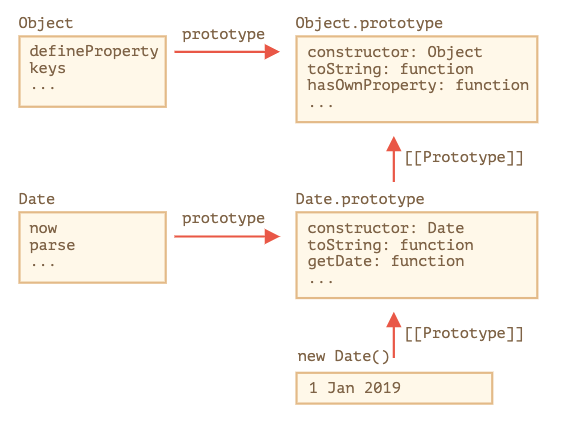

# 9.5 내장 클래스 확장하기
배열, 맵과 같은 내장 클래스도 확장이 가능하다. 

PowerArray 라는 클래스를 내장 클래스 Array 를 상속받아서 구현해 본다. 

```js
// 메서드 하나를 추가합니다(더 많이 추가하는 것도 가능).
class PowerArray extends Array {
  isEmpty() {
    return this.length === 0;
  }
}

let arr = new PowerArray(1, 2, 5, 10, 50);
alert(arr.isEmpty()); // false

let filteredArr = arr.filter(item => item >= 10);
alert(filteredArr); // 10, 50
alert(filteredArr.isEmpty()); // false
```

주목할 점은 filter, map 등의 내장 메서드가 상속받은 클래스인 PowerArray를 반환한다는 점이다. 

`arr.filter()`가 호출될때 내부에선 기본 Array 가 아닌 `arr.constructor`를 기반으로 새로운 배열이 만들어지고 여기에 필터 후 배열이 담긴다. 

이러한 동작 방법을 바꾸기 특수 정적 getter인 `[Symbol.species]`를 추가할 수 있다. 

getter에서 명시한 클래스로 내장 메서드에 반환값을 결정할 수 있다. 

```js
class PowerArray extends Array {
  isEmpty() {
    return this.length === 0;
  }

  // 내장 메서드는 반환 값에 명시된 클래스를 생성자로 사용합니다.
  static get [Symbol.species]() {
    return Array;
  }
}

let arr = new PowerArray(1, 2, 5, 10, 50);
alert(arr.isEmpty()); // false

// filter는 arr.constructor[Symbol.species]를 생성자로 사용해 새로운 배열을 만듭니다.
let filteredArr = arr.filter(item => item >= 10);

// filteredArr는 PowerArray가 아닌 Array의 인스턴스입니다.
alert(filteredArr.isEmpty()); // Error: filteredArr.isEmpty is not a function
```

<br/>

## 내장 객체와 정적 메서드 상속
일반적으로 한 클래스가 다른 클래스를 상속 받으면 정적 메서드와 정적 프로퍼티를 상속 받는다. 

하지만 내장 클래스는 정적 메서드를 상속받지 못한다. 

예를 들어 `Date`의 경우 `Object`를 상속 받기 때문에 `Object.prototype`에 구현된 메서드를 사용할 수 있다.

하지만 `Object` 자체를 차조하는 어떠한 변수도 없기 때문에 `Object`에 선언된 정적 메서드는 사용할 수 없는 것이다. 

`Date`와 `Object`와의 관계는 다음과 같다. 

