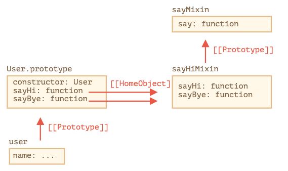

# 믹스인
자바스크립트에서는 단일상속만을 허용하는 언어이다. 

다중 상속이 필요한 경우는 어떻게 해야 할까? 

믹스인이라는 기능을 통해서 다른 클래스의 상속 없이 이들 클래스에 구현되어 있는 메서드를 담게 할 수 있다. 

믹슥인은 특정 행동을 실행해주는 메서드를 제공하는데 단독으로 쓰이지 않고 다른 클래스에 행동을 더해주는 용도로 사용된다.

<br/>

## 믹스인 예시
유용한 메서드가 여러 개가 담긴 객체를 하난 만든다. 

이렇게 하면 다수의 메서드를 원하는 클래스의 프로토타입에 쉽게 병합할 수 있다. 

```js
// 믹스인
let sayHiMixin = {
  sayHi() {
    alert(`Hello ${this.name}`);
  },
  sayBye() {
    alert(`Bye ${this.name}`);
  }
};

// 사용법:
class User {
  constructor(name) {
    this.name = name;
  }
}

// 메서드 복사
Object.assign(User.prototype, sayHiMixin);

// 이제 User가 인사를 할 수 있습니다.
new User("Dude").sayHi(); // Hello Dude!
```

믹스인을 사용했다면 만약 User가 다른 클래스를 상속 받고 있더라도 믹스인에 구현된 메서드를 사용할 수 있다. 

```js
class User extends Person {
  // ...
}

Object.assign(User.prototype, sayHiMixin);
```

믹스인인에서 클래스를 상속 받는것도 가능하다.
```js
let sayMixin = {
  say(phrase) {
    alert(phrase);
  }
};

let sayHiMixin = {
  __proto__: sayMixin, // (Object.create를 사용해 프로토타입을 설정할 수도 있습니다.)

  sayHi() {
    // 부모 메서드 호출
    super.say(`Hello ${this.name}`); // (*)
  },
  sayBye() {
    super.say(`Bye ${this.name}`); // (*)
  }
};

class User {
  constructor(name) {
    this.name = name;
  }
}

// 메서드 복사
Object.assign(User.prototype, sayHiMixin);

// 이제 User가 인사를 할 수 있습니다.
new User("Dude").sayHi(); // Hello Dude!
```

참조 관계



<br/>

## 이벤트 믹스인
클래스나 객체의 이벤트 관련함수를 쉽게 추가할 수 있는 믹스인을 만들어 보도록 한다. 

- 믹스인은 중요한 일이 발생했을 때 이벤트를 생성하는 메서드인 `.trigger(name, [...data])`를 제공함.
- 메서드 `.on(name, handler)`를 통해서 trigger 됬을 때 이벤트를 등록할 수 있음.
- 메서드 `.off(name, handler)`를 통해서 handler 리스너를 제거한다. 

믹스인을 축하면 사용자가 로그인할 때 객체 user 가 "login" 이라는 이벤트를 생성 한다든지의 기능을 만들 수 있다.

```js
let eventMixin = {
  /**
   *  이벤트 구독
   *  사용패턴: menu.on('select', function(item) { ... }
  */
  on(eventName, handler) {
    if (!this._eventHandlers) this._eventHandlers = {};
    if (!this._eventHandlers[eventName]) {
      this._eventHandlers[eventName] = [];
    }
    this._eventHandlers[eventName].push(handler);
  },

  /**
   *  구독 취소
   *  사용패턴: menu.off('select', handler)
   */
  off(eventName, handler) {
    let handlers = this._eventHandlers?.[eventName];
    if (!handlers) return;
    for (let i = 0; i < handlers.length; i++) {
      if (handlers[i] === handler) {
        handlers.splice(i--, 1);
      }
    }
  },

  /**
   *  주어진 이름과 데이터를 기반으로 이벤트 생성
   *  사용패턴: this.trigger('select', data1, data2);
   */
  trigger(eventName, ...args) {
    if (!this._eventHandlers?.[eventName]) {
      return; // no handlers for that event name
    }

    // 핸들러 호출
    this._eventHandlers[eventName].forEach(handler => handler.apply(this, args));
  }
};
```

사용법
```js
// 클래스 생성
class Menu {
  choose(value) {
    this.trigger("select", value);
  }
}
// 이벤트 관련 메서드가 구현된 믹스인 추가
Object.assign(Menu.prototype, eventMixin);

let menu = new Menu();

// 메뉴 항목을 선택할 때 호출될 핸들러 추가
menu.on("select", value => alert(`선택된 값: ${value}`));

// 이벤트가 트리거 되면 핸들러가 실행되어 얼럿창이 뜸
// 얼럿창 메시지: Value selected: 123
menu.choose("123");
```