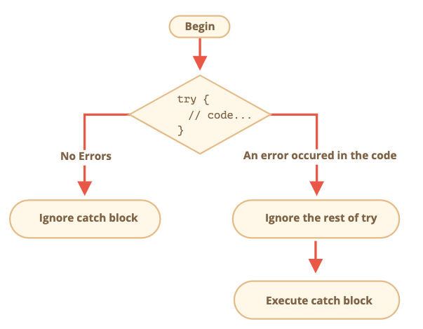

# try .. catch 와 에러 핸들링
에러가 발생하면 스크립트가 죽는다. 

try catch 를 사용하면 에러를 잡아서 합당한 무언가를 할 수 있게 된다. 

## try..catch 문법
```js
try {

  // 코드...

} catch (err) {

  // 에러 핸들링

}
```
1. 먼저 try 실행
2. 에러가 없다면 try 마지막 줄까지 실행되고 catch 블럭은 건너 뜀 
3. 에러가 있다면 catch 블럭이 실행되고, error 의 정보를 담은 err(이름 바뀔 수 있음.) 객체를 포함한 코드 블럭을 실행한다. 



> - try .. catch 는 런타임 에러에서만 동작함.
> - try .. catch 는 동기적으로 동작함. 


<br/>

## 에러 객체
에러가 발생하면 에러 상세 내용이 담긴 에러 객체를 생성하고 catch 블럭에 인수로 넘겨준다.

### 주요 프로퍼티
- name : 에러 이름
- message : 에러 상세 내용을 담고 있는 문자 메세지
- stack : 현제 호출 스택, 에러가 어디서 발생했는지에 대한 정보 


<br/>

## 선택적 catch 바인딩
자세한 정보가 필요 없으면 catch 블럭에서 인수로 error 객체를 생략할 수 있다.

<br/>

## try .. catch 사용하기
JSON.parse를 통해 예시를 들어봄.

잘못된 json 형식이 들어오면 JSON.parse 호출시 스크립트가 죽음.

```js
let json = "{ bad json }";

try {

  let user = JSON.parse(json); // <-- 여기서 에러가 발생하므로
  alert( user.name ); // 이 코드는 동작하지 않습니다.

} catch (e) {
  // 에러가 발생하면 제어 흐름이 catch 문으로 넘어옵니다.
  alert( "데이터에 에러가 있어 재요청을 시도합니다." );
  alert( e.name );
  alert( e.message );
}
```

<br/>

## 직접 에러 만들어서 던지기
문법적으로 잘못되진 않았지만 예상한 동작은 아니여서 error를 던지고 싶을땐 어떻게 해야 할까?

```js
let json = '{ "age": 30 }'; // 불완전한 데이터

try {

  let user = JSON.parse(json); // <-- 에러 없음
  alert( user.name ); // 이름이 없습니다!

} catch (e) {
  alert( "실행되지 않습니다." );
}
```
name 을 찾으면 undefined 가 아니라 error 를 던졌으면 좋겠다고 생각할 수 있다.

### throw 연산자 
에러를 생성함. 기본 문법

```js
throw <error object>
```

어떤 객체도 사용할 수 있지만 객체 안에 name 과 message 프로퍼티를 추가하기를 권장함. 

자바스크립트에 표준 에러 관련 생성자가 존재함. 

```js
let error = new Error(message);
// or
let error = new SyntaxError(message);
let error = new ReferenceError(message);
// ...
```

name 프로퍼티가 없을때 에러 생성하기

```js
let json = '{ "age": 30 }'; // 불완전한 데이터

try {

  let user = JSON.parse(json); // <-- 에러 없음

  if (!user.name) {
    throw new SyntaxError("불완전한 데이터: 이름 없음"); // (*)
  }

  alert( user.name );

} catch(e) {
  alert( "JSON Error: " + e.message ); // JSON Error: 불완전한 데이터: 이름 없음
}
```

<br/>

## 에러 다시 던지기
위에 같은 구조는 error를 종류에 맞게 처리하기 보다는 한꺼번에 처리하는 구조임. 

이런 문제를 피하기 위해서는 다시 던지기 기술을 사용해야 함(rethrowing)

catch는 알고 있는 에러만 처리하고 나머지는 다시 던저야 함.

```js
let json = '{ "age": 30 }'; // 불완전한 데이터
try {

  let user = JSON.parse(json);

  if (!user.name) {
    throw new SyntaxError("불완전한 데이터: 이름 없음");
  }

  blabla(); // 예상치 못한 에러

  alert( user.name );

} catch(e) {

  if (e instanceof SyntaxError) {
    alert( "JSON Error: " + e.message );
  } else {
    throw e; // 에러 다시 던지기 (*)
  }

}
```
던져진 에러에 대한 catch 도 해줘야 함.

```js
function readData() {
  let json = '{ "age": 30 }';

  try {
    // ...
    blabla(); // 에러!
  } catch (e) {
    // ...
    if (!(e instanceof SyntaxError)) {
      throw e; // 알 수 없는 에러 다시 던지기
    }
  }
}

try {
  readData();
} catch (e) {
  alert( "External catch got: " + e ); // 에러를 잡음
}
```

<br/>

## try...catch...finally
finally 는 에러가 있든 없든 마지막에는 꼭 실행되는 코드 블럭이다. 

```js
try {
  alert( 'try 블록 시작' );
  if (confirm('에러를 만드시겠습니까?')) 이상한_코드();
} catch (e) {
  alert( 'catch' );
} finally {
  alert( 'finally' );
}
```

에러를 만들겠다고 하면 catch 절이 실행 된다음 finally 블럭이 실행됨.

에러를 안만들겠다고 하면 try 절만 실행되고 finally 블럭이 실행됨. 

> - try.. catch.. finally 안의 변수는 지역 변수이다.
> - finally와 return ( try catch 절에서 return 하면 에러 발생 여부 상관 없이 fianlly 가 실행됨. finally 는 try catch 코드 블럭을 벗언나면 무조건 실행되는 코드 블럭임. 


<br/>

## 전역 catch
코어 자바스크립트가 아님.

try catch 밖에서 발생한 에러는 어떻게 처리해야 할까?

호스트 마다 다르지만 이런 에러를 처리하는 것은 중요한 일이기 때문에 지원하고 있다. 

Node.js 에서는 `process.on("uncaughtException")` 브라우저 환경에서는 `window.onerror`

문법

```js
window.onerror = function(message, url, line, col, error) {
  // ...
};
```
- message : 에러 메세지
- url : 에러가 발생한 스크립트의 url 
- line, col : 에러가 발생한 곳의 줄과 열 번호 
- error : 에러 객체

window.onerror를 사용해서 죽어버린 스크립트를 복구하기에는 문제가 있음.

개발자에게 어디서 에러가 났는지 알려주는 목적으로 많이 사용함. 
