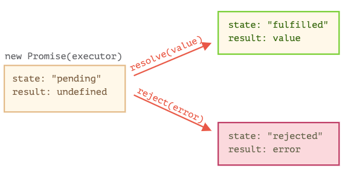

# 프라미스

프라미스를 비유로 설명하면 다음과 같다. 

1. 제작 코드는 시간이 걸리는 일로서 가수가 제작한 코드라고 할 수 있다. 
2. 소비 코드는 제작 코드의 결과를 기다리는 코드로 팬이라고 할 수 있다. 
3. 프라미스는 제작코드와 소비코드를 연결해 주는 특별한 자바스크립트 객체이다. 제작 코드가 완료되면 알려주는 역활을 하며 구독 서비스라고 할 수 있다. 

```js
let promise = new Promise(function(resolve, reject) {
  // executor (제작 코드, '가수')
});
```

executor는 promise 가 생성될때 실행된다. resolve와 reject는 js에서 기본으로 제공해 주는 함수로서 개발자는 excutor 만 신경쓰면 된다. 다만, ecutor에서 resolve든 reject든 하나를 반드시 호출해야 한다. 

- resolve(value) - 일이 성공적으로 끝난 경우 
- reject(error) - 에러 발생 시 

`new Promise` 생성자가 반환하는 `promise` 객체는 다음과 같은 내부 프로퍼티를 갖습니다. 



- state - 처음에 pending 이었다가 resolve 가 호출되면 fulfilled, reject가 호출되면 rejected
- result - 처음에 undefined 이었다가 resolve 가 호출되면 value, reject 가 호출되면 error

간단한 예시

```js
let promise = new Promise(function(resolve, reject) {
  // 프라미스가 만들어지면 executor 함수는 자동으로 실행됩니다.

  // 1초 뒤에 일이 성공적으로 끝났다는 신호가 전달되면서 result는 'done'이 됩니다.
  setTimeout(() => resolve("done"), 1000);
});

```

프로미스 객체의 변화


반대로 거절한 경우

```js
let promise = new Promise(function(resolve, reject) {
  // 1초 뒤에 에러와 함께 실행이 종료되었다는 신호를 보냅니다.
  setTimeout(() => reject(new Error("에러 발생!")), 1000);
});
```

프로미스 객체의 변화


이행이나 거부된 프로미스를 처리된(settled)된 프라미스라고 한다. 반대로 처리가 안된 프라미스는 pending 상태라고 한다. 

> - 프라미스는 성공 또는 실패만 합니다. 성공했다가 실패하고 이렇게 할 수 없다. 
> - reject는 어떤 객체도 인수로 넘겨 줄 수 있지만 Error 객체를 사용할 것을 추천한다. 혹은 Error 객체를 상속 받는 객체를 사용할것.
> - state와 resulot는 내부 프로퍼티로 개발자가 직접 접근할 수 없다. then catch finally 를 사용해야 접근 가능


## 소비자: then, catch, finally

프라미스는 excutor와 소비함수를 이어주는 역할을 한다. 소비 함수는 then, catch, finally 를 사용하여 등록한다. (구독)

### then

```js
promise.then(
  function(result) { /* 결과(result)를 다룹니다 */ },
  function(error) { /* 에러(error)를 다룹니다 */ }
);
```

성공적으로 이행된 프라미스가 어떻게 반응하는지

```js
let promise = new Promise(function(resolve, reject) {
  setTimeout(() => resolve("done!"), 1000);
});

// resolve 함수는 .then의 첫 번째 함수(인수)를 실행합니다.
promise.then(
  result => alert(result), // 1초 후 "done!"을 출력
  error => alert(error) // 실행되지 않음
);
```

프라미스가 거부된 경우 두번째 함수가 실행된다. 

```js
let promise = new Promise(function(resolve, reject) {
  setTimeout(() => reject(new Error("에러 발생!")), 1000);
});

// reject 함수는 .then의 두 번째 함수를 실행합니다.
promise.then(
  result => alert(result), // 실행되지 않음
  error => alert(error) // 1초 후 "Error: 에러 발생!"를 출력
);
```

작업이 성공적으로 처리된 경우만 다루고 싶다면 .then 인수로 하나만 전달하면 된다. 

### catch

에러를 처리하고 싶다면 `.then(null, errorHandlerFunction)`과 같이 사용하면되는데, `.catch(errorHandlerFunction)` 을 사용해도 동일하게 작동한다. 

```js
let promise = new Promise((resolve, reject) => {
  setTimeout(() => reject(new Error("에러 발생!")), 1000);
});

// .catch(f)는 promise.then(null, f)과 동일하게 작동합니다
promise.catch(alert); // 1초 뒤 "Error: 에러 발생!" 출력
```

### finally

무조건 실행되는 함수 를 등록한다. `.then(f, f)`와 유사하다. 

```js
new Promise((resolve, reject) => {
  /* 시간이 걸리는 어떤 일을 수행하고, 그 후 resolve, reject를 호출함 */
})
  // 성공·실패 여부와 상관없이 프라미스가 처리되면 실행됨
  .finally(() => 로딩 인디케이터 중지)
  .then(result => result와 err 보여줌 => error 보여줌)
```

1. finally 는 보변적으로 처리되어야 하는 함수를 등록하기 때문에 성공 실패 여부를 모른다. finally 핸들러엔 인수가 없다.
2. 자동으로 다음 핸들러에 결과와 에러를 전달한다.

```js
new Promise((resolve, reject) => {
  setTimeout(() => resolve("결과"), 2000)
})
  .finally(() => alert("프라미스가 준비되었습니다."))
  .then(result => alert(result)); // <-- .then에서 result를 다룰 수 있음
```

finally는 결과를 처리하기 위해서 만들어진게 아니기 때문에 통과해서 다음 으로 전달된다. 


## 예시 : loadScript

```js
function loadScript(src, callback) {
  let script = document.createElement('script');
  script.src = src;

  script.onload = () => callback(null, script);
  script.onerror = () => callback(new Error(`${src}를 불러오는 도중에 에러가 발생함`));

  document.head.append(script);
}
```

```js
function loadScript(src) {
  return new Promise(function(resolve, reject) {
    let script = document.createElement('script');
    script.src = src;

    script.onload = () => resolve(script);
    script.onerror = () => reject(new Error(`${src}를 불러오는 도중에 에러가 발생함`));

    document.head.append(script);
  });
}
```

사용법

```js
let promise = loadScript("https://cdnjs.cloudflare.com/ajax/libs/lodash.js/4.17.11/lodash.js");

promise.then(
  script => alert(`${script.src}을 불러왔습니다!`),
  error => alert(`Error: ${error.message}`)
);

promise.then(script => alert('또다른 핸들러...')); // 원하는 만큼 등록 가능.
```

