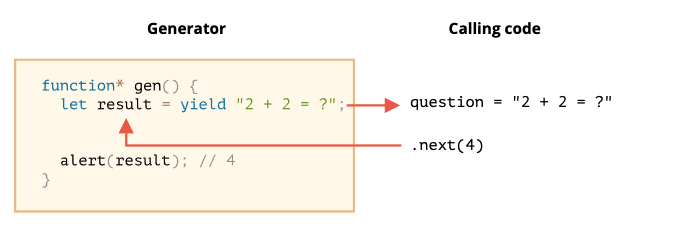

# 제너레이터
제너레이터를 사용하면 여러 개의 값을 필요에 따라 하나씩 반환 할 수 있다. 

## 제너레이터 함수
사용법
```js
function* generateSequence() {
  yield 1;
  yield 2;
  return 3;
}
```
제너레이터 함수는 코드가 실행되지 않고 대신에 실행을 처리하는 특별 객체, '제너레이터 객체' 가 반환된다. 

```js
function* generateSequence() {
  yield 1;
  yield 2;
  return 3;
}

// '제너레이터 함수'는 '제너레이터 객체'를 생성합니다.
let generator = generateSequence();
alert(generator); // [object Generator]
```
`next()`는 제너레이터의 주요 메서드이다. 이 메서드를 호출하면 `yield <value>`를 만날때까지 계속 실행되다가 `value`를 반환한다. `value`를 지정 안할 수 도 있는데 이 경우 `undefined`가 반환된다. 

`next()`는 항상 다음 두가지 프로퍼티를 가진 객체를 반환한다. 
- `value` : 산출 값
- `done` : 함수 코드 실행이 끝났으면 `true`, 아니라면 `false`

```js
function* generateSequence() {
  yield 1;
  yield 2;
  return 3;
}

let generator = generateSequence();

let one = generator.next();

alert(JSON.stringify(one)); // {value: 1, done: false}
```
제너레이터는 `yield 1` 부분에 멈추고 아직 제너레이터 가 끝난게 아니기 때문에 `done: false` 가 된다. 

같은 방법으로 2번 더 `.next()`를 호출하면 마지막에 `{ value: 3, done: true}` 인 객체를 반환하고 제너레이터는 종료 된다. 이 다음 부터는 `.next()`를 호출하더라도 `{done: true}`인 객체만 반환할 뿐이다. 

## 제너레이터와 이터러블 
제너레이터는 이터르블 이다. 따라서 `for..of` 반복문을 사용해 값을 얻을 수 있다. 

```js
function* generateSequence() {
  yield 1;
  yield 2;
  return 3;
}

let generator = generateSequence();

for(let value of generator) {
  alert(value); // 1, 2가 출력됨
}
```
그런데 주의할 점은 3은 출력되지 않는다는 것이다. 그 이유는 `for..of` 이터레이션은 `done:true`일때 마지막 `vlaue`를 무시하기 때문이다. 3을 출력되게 하고 싶다면 `return`이 아니라 `yield 3` 으로 반환해야 한다. 


제너레이터는 이터러블 객체이므로 제너레이터에도 전개 문법 같은 관련 기능을 사용할 수 있다. 

```js
function* generateSequence() {
  yield 1;
  yield 2;
  yield 3;
}

let sequence = [0, ...generateSequence()];

alert(sequence); // 0, 1, 2, 3
```

## 이터러블 대신 제너레이터 사용하기
이터러블 코드 예시
```js
let range = {
  from: 1,
  to: 5,

  // for..of 최초 호출 시, Symbol.iterator가 호출됩니다.
  [Symbol.iterator]() {
    // Symbol.iterator는 이터레이터 객체를 반환합니다.
    // for..of는 반환된 이터레이터 객체만을 대상으로 동작하는데, 이때 다음 값도 정해집니다.
    return {
      current: this.from,
      last: this.to,

      // for..of 반복문에 의해 각 이터레이션마다 next()가 호출됩니다.
      next() {
        // next()는 객체 형태의 값, {done:.., value :...}을 반환해야 합니다.
        if (this.current <= this.last) {
          return { done: false, value: this.current++ };
        } else {
          return { done: true };
        }
      }
    };
  }
};

// 객체 range를 대상으로 하는 이터레이션은 range.from과 range.to 사이의 숫자를 출력합니다.
alert([...range]); // 1,2,3,4,5
```

`Symbol.iterator` 대신 제너레이터 함수를 사용하면, 제너레이터 함수로 반복이 가능하다. 

```js
let range = {
  from: 1,
  to: 5,

  *[Symbol.iterator]() { // [Symbol.iterator]: function*()를 짧게 줄임
    for(let value = this.from; value <= this.to; value++) {
      yield value;
    }
  }
};

alert( [...range] ); // 1, 2, 3, 4, 5
```
원래 제너레이터는 이터레이터를 어떻게 하면 쉽게 구현할지 염두에 두며 자바스크립트에 출시되었다. 제너레이터를 사용하면 이터레이터를 쓰면 복잡한 코드를 같은 기능으로 간결하게 작성할 수 있다. 

## 제너레이터 컴포지션
제너레이터 안에 제너레이터를 임베딩(embedding, composing) 할 수 있게 해주는 제너레이터의 특별 기능이다. 

연속된 숫자를 생성하는 제너레이터 함수를 만들어 본다.
```js
function* generateSequence(start, end) {
  for (let i = start; i <= end; i++) yield i;
}
```

문자나 숫자에 적용해서 비밀번호를 생성하는 함수를 반들수 있다. 일반 함수로 구혆가ㅣ 위해서는 여러개의 함수를 만들고 그 호출 결과를 어딘가에 저장한 후 다시 그 결과들을 조합해야 원하는 기능을 구현할 수 있다. 
하지만 특수 문법 `yield*` 를 사용하면 제너레이터를 다른 제너레이터에 끼워 넣을 수 있다. 

```js
function* generateSequence(start, end) {
  for (let i = start; i <= end; i++) yield i;
}

function* generatePasswordCodes() {

  // 0..9
  yield* generateSequence(48, 57);

  // A..Z
  yield* generateSequence(65, 90);

  // a..z
  yield* generateSequence(97, 122);

}

let str = '';

for(let code of generatePasswordCodes()) {
  str += String.fromCharCode(code);
}

alert(str); // 0..9A..Za..z
```

`yield*` 지시자는 실행을 다른 제너레이터에 위임한다. 제너레이터를 대상으로 반복을 수행하고, 산출 값들을 바깥으로 전달한다는 것을 의미한다. 

## `yield` 를 사용해 제너레이터 안, 밖으로 정보 교환하기
제너레이터의 `yield`는 양방향 길과 같은 역할을 한다. `yield` 는 결과를 바깥으로 전달할 뿐만 아니라 값을 제너레이터 안으로 전달하기까지 한다. 값을 안, 밖으로 전달하려면 `generate.next(arg)` 를 호출해야 한다. 
이때 인수 `arg`는 `yield`의 결과가 된다. 
```js
function* gen() {
  // 질문을 제너레이터 밖 코드에 던지고 답을 기다립니다.
  let result = yield "2 + 2 = ?"; // (*)

  alert(result);
}

let generator = gen();

let question = generator.next().value; // <-- yield는 value를 반환합니다.

generator.next(4); // --> 결과를 제너레이터 안으로 전달합니다.
```



1. `generator.next()`를 처음 호출할 댄 항상 인수가 없어야 한다. 인수가 들어오면 무시함 이때 `yield "2+2=?"`의 결과가 반환된다. 
2. 변수 `question`에 이 값이 할당된다. 
3. `generator.next(4)` 를 호출하면 인수 4 가 `result`에 할당된다. 

제너레이터와 외부 호출코드는 `next/yield`를 이용해 결과를 전달 및 교환한다. 

```js
function* gen() {
  let ask1 = yield "2 + 2 = ?";

  alert(ask1); // 4

  let ask2 = yield "3 * 3 = ?"

  alert(ask2); // 9
}

let generator = gen();

alert( generator.next().value ); // "2 + 2 = ?"

alert( generator.next(4).value ); // "3 * 3 = ?"

alert( generator.next(9).done ); // true
```

코드를 실행하면 차례대로 다음과 같이 출력된다. 
- 2 + 2 = ?
- 4
- 3 * 3 = ?
- 9
- true

## generator.throw
generator 외부 코드가 에러를 만들거나 던질 수도 있다. 에러를 `yield` 안으로 전달하려면 `generator.throw(err)`를 호출해야 한다. 호출하면 `err`는 `yield` 가 있는 줄로 던져진다. 

```js
function* gen() {
  try {
    let result = yield "2 + 2 = ?"; // (1)

    alert("위에서 에러가 던져졌기 때문에 실행 흐름은 여기까지 다다르지 못합니다.");
  } catch(e) {
    alert(e); // 에러 출력
  }
}

let generator = gen();

let question = generator.next().value;

generator.throw(new Error("데이터베이스에서 답을 찾지 못했습니다.")); // (2)
```
(2)에서 던진 에러는 (1) 에서 예외를 만든다. 만약 제너레이터 안에서 에러를 처리 하지 않았다면 외부로 떨어져 나온다. 바깥에서 에러를 처리해도 된다. 

```js
function* generate() {
  let result = yield "2 + 2 = ?"; // Error in this line
}

let generator = generate();

let question = generator.next().value;

try {
  generator.throw(new Error("데이터베이스에서 답을 찾지 못했습니다."));
} catch(e) {
  alert(e); // 에러 출력
}
```
