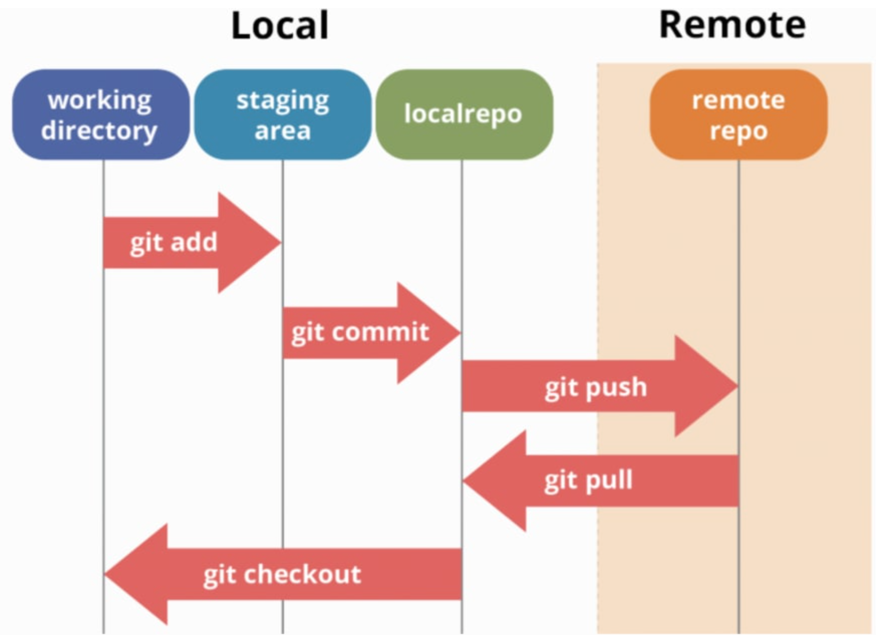

# git basic
- 리눅스에 대해서 간략히 공부했다.
- git의 대한 기본적인 설정방법과 사용법을 알아보고 리뷰터와 조를 이루어 풀리퀘스트를 요청화는 과정을 연습해 보았다.


## Linux
리눅스는 unix 기반에 오픈소스 운영체제로서 수많은 배포 버전이 있다. 헬싱키 대학생이던 리누스 토발즈가 앤디 타넨 비우의 MINX를 개조한 Linux를 배포했다. 

### Kernel
커널은 하드웨어와 응용 프로그램을 이어주는 운영체제의 핵시 소프트 웨어이다.

### Shell
쉘은 운영체제의 커널과 사용자를 이어주는 소프트웨어로서 사용자가 Kernel를 제어하기 위해 새용한다.


## git object
git에는 3가지의 객체가 있다. 
1. Blob: 파일 하나의 대한 정보로서 사진으로 비유하자면 사진 파일 자체인 .jpg 파일이 될 수 있다.
2. Tree: Blob 이나 subtree 의 메타데이터로서 사진으로 비유하자면 찍히 날짜에 대한 정보라던지, 저장된 위치 같은 정보가 될 수 있다.
3. Commit: 커밋 순간의 스냅샷으로서 버전으로 저장하려고 압축한 파일들과 같다.


## git 저장소
git repo 에는 크게 Local 저장소와 remote 저장소가 있다. 흔히 사용하는 github과 같은 서비스가 remote 저장소라고 할 수 있다.

Local 저장소는 크게 3가지 상태로 나눌 수 있다. 
1. Working Directory : 지금 작업하고 있는 폴더이다. `git init`을 통해 git repo를 만들거나 clone 받은 폴더가 될 수 있다.
2. staging area : `git add` 를 통해 추가한 파일들에 상태를 말한다. 아직 커밋을 하기 전 상태이며 add를 해야지 git 에서 버전을 추적할 수 있다.
3. localrepo : `git commit`을 수행해서 버전이 등록한 파일들에 상태이다. `git push`를 통해 remote 저장소로 파일을 올리거나 `git pull`을 통해 받아올 수 있다. 




## configure
깃을 사용하기전 환경 설정으로 해주면 좋을 것들을 알아본다.
```
$ git config --global user.name "당신의유저네임"
$ git config --global user.email "당신의메일주소"
$ git config --global core.editor "vim"
$ git config --global core.pager "cat"
$ git config --global init.defaultBranch "main"
```
commit 을 입력할 editor을 vim으로 설정하는 설정과 default branch를 main으로 바꾸는 설정이 포함되어 있다. 필수적인 사항은 아니다. 

만약 환경변수 설정을 내리고 싶다면 `--unset` 플래그를 추가하면된다.

`git config --global --unset core.editor`

## Commit Convention
commit을 한번에 알기쉽게 하기위해서 보편적으로 사용하는 규칙들이 있다. 
- feat: features (기능 개발에 대한 커밋)
- docs: documentations (문서 작업에 대한 커밋)
- conf: configurations (환경 변수 설정에 대한 커밋 ex)node pakage)
- test: test (test 코드에 대한 수정 생성에 대한 커밋)
- fix: bug-fix (버그를 고치거나 에러를 고친 커밋)
- refactor: refactoring (같은 기능을 하나 보기 좋고 효율적인 코드로 대체했을때)
- ci: Continuous Integration 
- build: Build
- perf: Performance

이 외에도 제목은 50자 이내로 간결하게 작성하고 내용은 되도록 상세히 작성하도록 한다.
```
feat: add back button

add back button using <buuton> tag

TODO
- create page

```


## 작업의 단위
commit 작업의 단위는 어떻게 될까? 

commit 을 하는 단위는 어떤 동작을 기준으로 한다고 보면된다. JS에서 예를 들자면 어떤 함수를 만들고 동작까지 확인했다면 그때를 commit 기점으로 생각하면된다.

작업 최소 단위로 생각하고 세세하게 작성하도록 한다.


## staging area가 있는 이유?
만약 staging area 가 없다면 어떻게 될까? 

우리는 모든 파일에 변경에 커밋을 한번에 날려야할 것이다. 만약 문서화 작업에대한 변경과 기능 추가에 대한 변경이 존재한다면 이를 한꺼번에 커밋해야 되는 것이다.

stging area 가 있기 때문에 하나의 파일을 올려두고 staging area 에 있는 파일을 commit 대상으로 삼을 수 있다. 

## pull request 실습
github repo > Settings > Mnage access > Invate a collaborator 를 통해 코드 리뷰어를 초대한다.

새로운 브렌치를 만들어 기능을 만든다.
```
$ git branch [new branch name]
$ git checkout [new branch name]
$ git add [수정한 파일]
$ git commit
$ git push -u origin [new branch name]
```

새로운 브랜치를 로컬에서 생성했다면 remote repo 에는 새로운 브랜치가 없을 것이다. -u 플래그를 통해 새로운 브랜치를 remote repo 에 생성하면서 push 할 수 있다. 

github 저장소로 이동하여 pull request를 요청한다.

이제 코드 리뷰어가 코드를 보고 수정할 것을 요청할 것이다. 그럼 다시 로컬 저장소로 돌아와서 파일을 수정하고 push 하는 과정까지 진행하면된다. 

코드리뷰어가 확인하고 문제가 없다 판단하면 승인을 해줄 것이다. 그럼 merge 를 클릭하여 remote repo 에 브랜치를 머지하면된다.

로컬 저장소에는 아직 머지 되지 않은 상태 이기 때문에 머지명령어를 입력한다.
```
$ git checkout main
$ git fecth origin main
$ git merge FETCH_HEAD
```
사실 `git pull origin main` 을 통해서도 동일한 과정을 진행할 수 있다. 내부적으로 보자면 git pull을 통한 머지가 위에 코드블럭에서 설명한 것을 똑같이 수행한다.

차이점은 fetch를 통해 이시적으로 받아올 수 있기 때문에 변경사항을 확인하면서 머지할 수 있다는 것이다. 복잡한 코드를 머지해야 할때나 다시한번 확인이 필요할 경우가 있을 수 있으니 fetch를 사용하도록 하자. 


## 다음에 배울 것
branch 를 더 배울 예정이다.
풀 리퀘스트하는 과정을 더 연습해서 익숙해 지도록 해야 겠다. 


