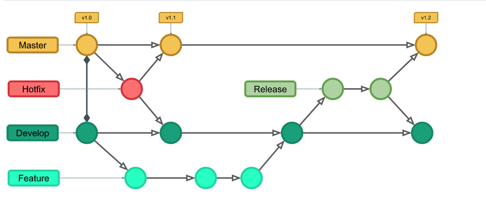

# branch
분기점을 생성하여 독립적으로 코드를 변경할 수 있도록 도와주는 모델 

모든 작업을 시작할때에는 브랜치를 만들어서 작업 하기를 권장. 

기능 구현이 완료 되었으면 해당 브랜치를 main 브렌치로 머지하고 해당 브랜치를 삭제 하는 것으로 작업을 하면 된다.

<br/>

## git flow
대표적인 branchg models 중에 하나이다. 

git flow 는 branch 를 
- master
- develop
- hotfix
- release
- feature

로 나누어서 관리한다. 




메인 스트림 브렌치는 master(main) 과 devlop 으로 나뉜다. 

프로젝트를 생성하면 main 브렌치와 devlop 브렌치로 나뉘고 각각 팀원들은 devlop 브렌치에서 작업을 수행한다.

새로운 기능을 구현해야 할때에는 feature 브렌치를 만든다. 

feature 브렌치에서 기능이 완료 된 후 develop 브렌치로 머지하고 feature 브렌치는 삭제한다. 

기능이 어느정도 개발이 완료되서 새로운 버전을 출시해도 되겠다 싶으면 release 브렌치를 만든다. 

release 브렌치에서는 어떤 기능을 개발해서는 안되고 버전을 올리기 전에 문서를 정리한더 던지 사용자에게 보이지 말하야 할 부분을 가린다던지에 기능 개발 외적인 작업을 수행한다. 

작업이 완료되면 relesae를 끝내면 되는데 이때 작업한 내용은 각각 main 브렌치와 develop 브렌치로 병합된다. 

hotfix 는 버그가 생겼다던지 빠른 시일내에 고쳐야 하는 긴급한 이슈가 생겼을때 만든다.

긴급히 수정한 이후에는 release 와 같이 main 과 develop 브렌치로 병합된다. 

### git flow command
홈 브루를 이용하여 git flow를 설치한다. 

`brew install git-flow-avh`

#### 초기화
깃 레포에서 실행.

`git flow init` 

#### feature
새기능 브렌치 만들고 브렌치로 switch

`git flow feature start MYFEATURE`

기능 개발 완료 

`git flow feature finish MYFEATRUE`

기능을 공동으로 개발하고 있을 때 (게시)

`git flow feature publish MYFEATURE`

게시된 기능 가져오기 

`git flow feature pull origin MYFEATURE`


#### 릴리즈
릴리즈 시작

`git flow release start version`

릴리즈 완료

`git flow release finish version`

릴리즈 완료후 테그에 대한 정보도 확인해야 한다. 

테그가 있는지 확인하려면 

`git tag`

tag 를 원격 저장소로 push 하려면

`git push --tags`

#### 핫 픽스 
핫 픽스 시작

`git flow hitfix start version`

핫 픽스 완료 

`git flow hotfix finish version`

<br/>

## 충돌, 되돌리기
충돌이 발생하면 충돌이 발생한 파일에 구분선을 통해서 어느 부분이 다른지 표시해 준다. 

해당 파일을 열어서 몇가지 선택 하면 된다.

1. 현재 로컬 코드로 만든다. 
2. 리모트 코드로 만든다. 
3. 로컬과 리모트 코드를 섞는다. 

만약 파일에 이름을 변경 하고 싶다거나 이동하고 싶다면?

그냥 하게 되면 파일이 삭제되고 다시 생성하는것과 같게 된다. 

따라서 그동안의 변경 이력이 다 날라가게 됨으로 git 명령어를 이용한다. 

`git mv ~`

### 되돌리기
1. reset 
2. revert

어느 한 시점만 삭제하는것은 불가능하다. 

그 시점으로 돌아가서 다시 시작하는 것은 가능하다.

reset을 통해 되돌아 가면 되돌아간 내역들이 모두 삭제됨으로 권장하는 방법은 아니다. 

```
git reset --hard HEAD~3
```

revert 를 통해서 돌아가기를 권장함.

```
git revert --no-commit HEAD~3.행

git commit
```

HEAD 에서 3개의 commit을 순서대로 올라가 해당 내역에 대한 commit, push 수행

